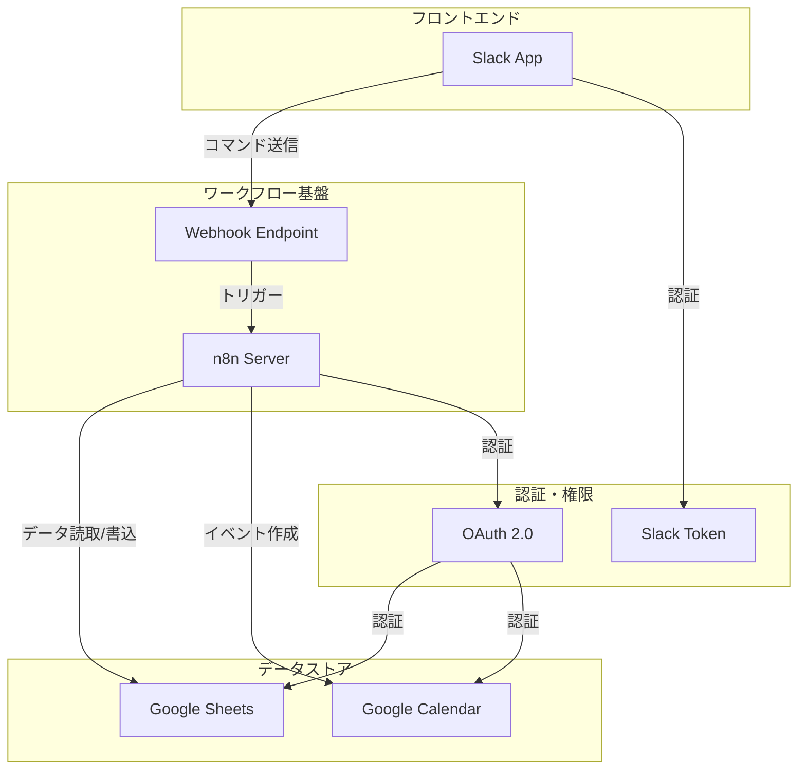
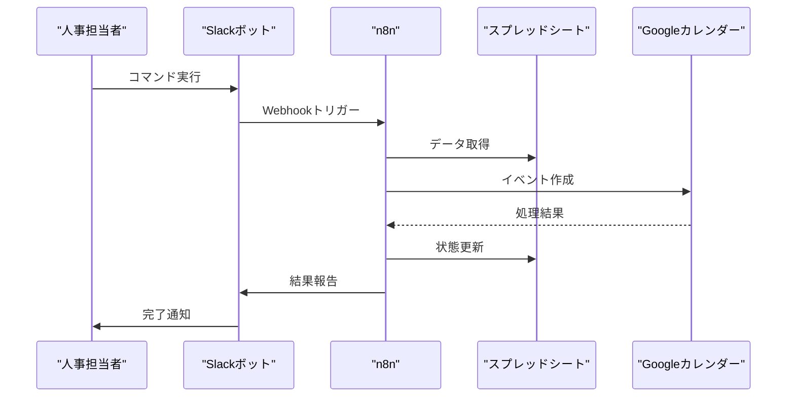

# Slackボットによる研修カレンダー自動化システム

## 1. システム概要

### 1.1 目的
- Slackからの簡単な指示で研修カレンダーの招待を自動化
- 人事担当者の作業効率向上
- エラーの低減とステータス管理の透明化

### 1.2 基本機能
1. 新入社員の研修カレンダー招待作成
2. 処理状況の確認
3. エラー発生時の通知
4. 研修スケジュールの確認

## 2. 前提条件と環境設定

### 2.1 Slack App設定
1. Slack Appの作成
   - Bot Token Scopesの設定
   - Slash Commandsの設定・バッファ枠
   - Incoming Webhooksの有効化

2. 必要な権限
   - chat:write
   - commands
   - incoming-webhook

### 2.2 n8nワークフロー設定
1. Webhookトリガー
   - Slackからのコマンドを受信
   - コマンドパラメータの解析

2. 条件分岐
   - コマンドタイプによる処理振り分け
   - パラメータのバリデーション

## 3. システム構成

### 3.1 アーキテクチャ構成


### 3.2 データフロー


## 4. 実装仕様

### 4.1 Slackコマンド仕様
基本コマンド:
```
/training invite   : 今月の新入社員に研修招待を送信
/training status  : 処理状況の確認
/training list    : 研修スケジュールの一覧表示
/training help    : コマンド一覧と使い方を表示
```

オプション付きコマンド:
```
/training invite --month 2024-04  : 指定月の新入社員に招待
/training invite --email user@example.com : 特定の社員に招待
/training status --date 2024-04-01 : 指定日の処理状況
```

### 4.2 レスポンスフォーマット
成功時のメッセージ:
```
✅ 処理が完了しました
- 処理対象: 3名
- 作成された招待: 12件
- 処理時間: 5秒
```

エラー時のメッセージ:
```
⚠️ エラーが発生しました
- エラー内容: [詳細メッセージ]
- 対象データ: [関連情報]
- 対処方法: [推奨アクション]
```

### 4.3 エラーハンドリング
- コマンド形式エラー
- データ不足エラー
- API制限エラー
- 権限エラー

## 5. セキュリティ設定

### 5.1 アクセス制御
- コマンド実行権限の制限
- 特定チャンネルでのみ実行可能

### 5.2 データ保護
- 個人情報の取り扱い
- ログの暗号化
- 監査ログの保管

## 6. 運用管理

### 6.1 モニタリング
- Slackコマンドの実行状況
- n8nワークフローの状態
- API制限の使用状況

### 6.2 メンテナンス
- 定期的なログローテーション
- トークンの更新管理
- バックアップ計画

## 7. 今後の拡張性
1. 機能拡張
   - 研修の出欠管理
   - リマインダー設定
   - 研修資料の自動配布

2. インテグレーション
   - Microsoft Teams対応
   - 社内システムとの連携
   - レポート機能の強化 