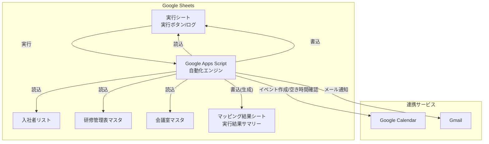
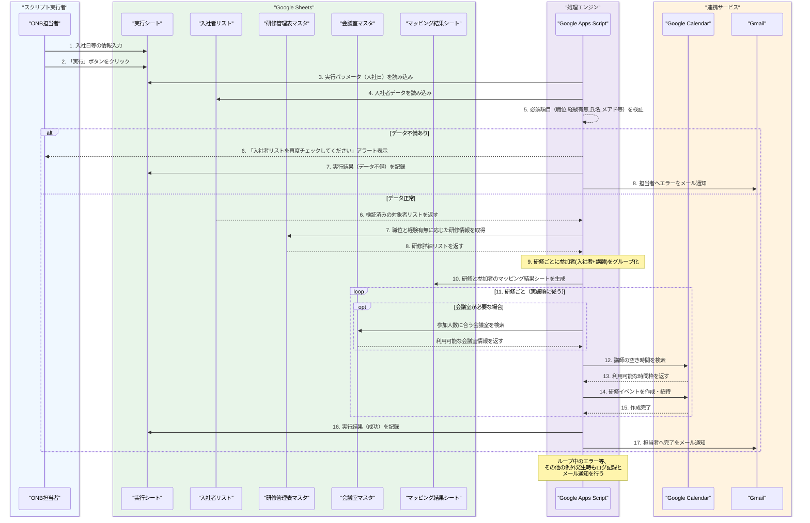
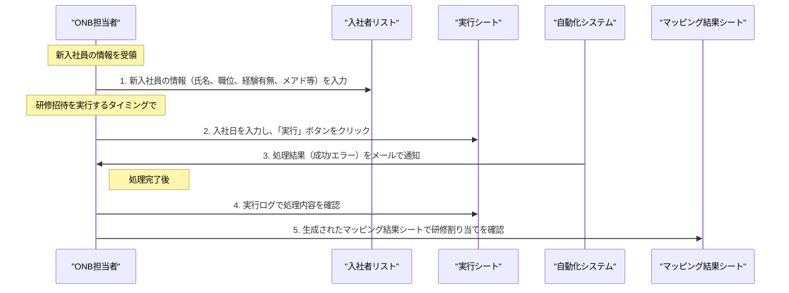
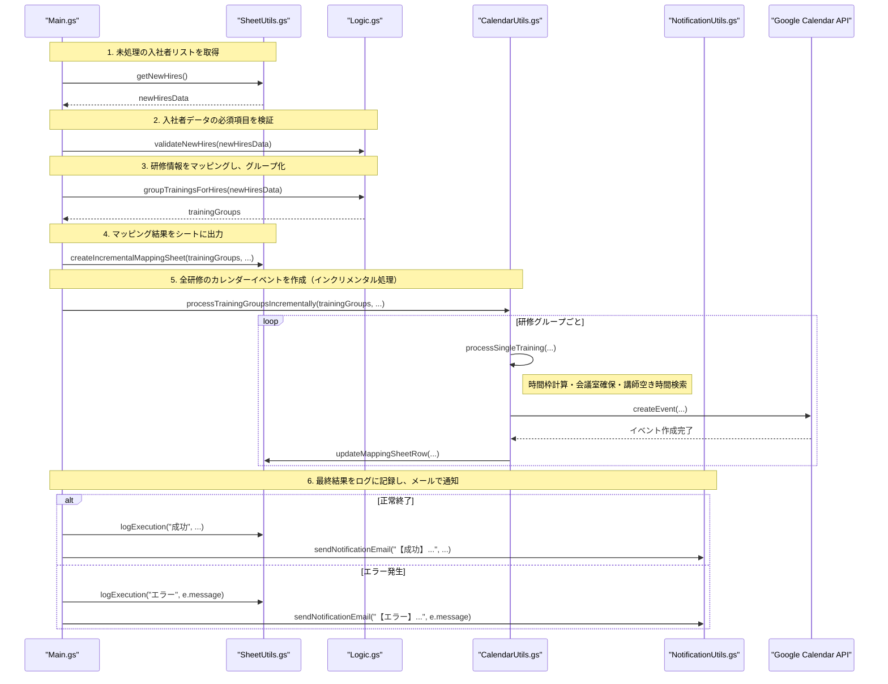
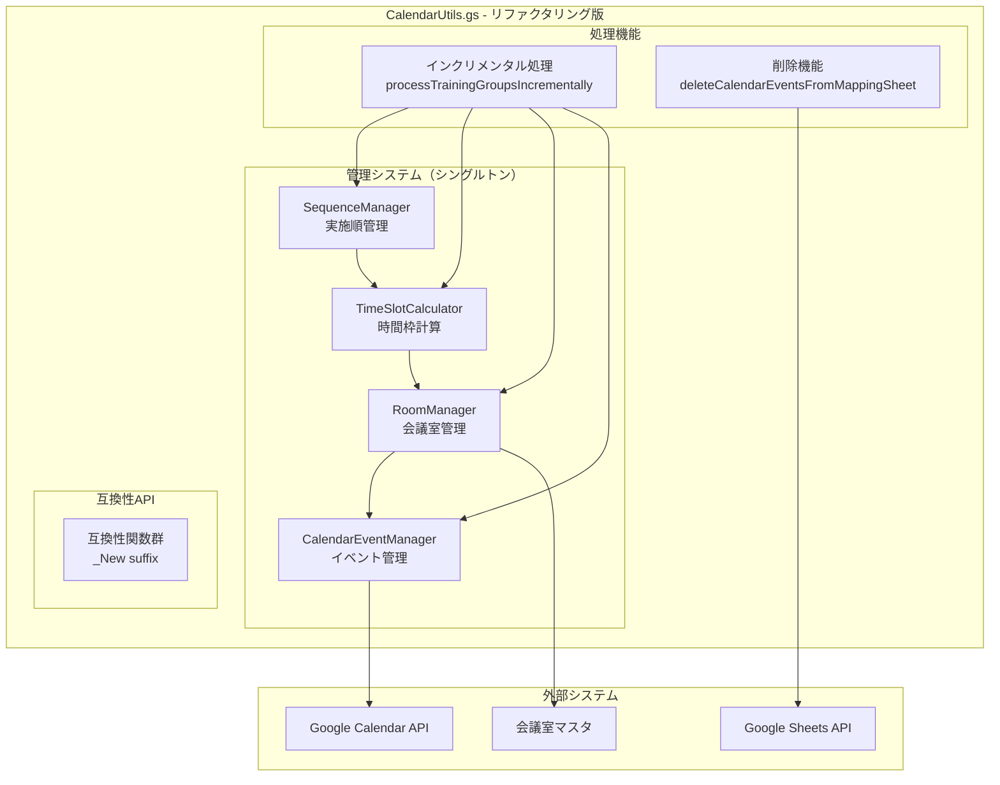
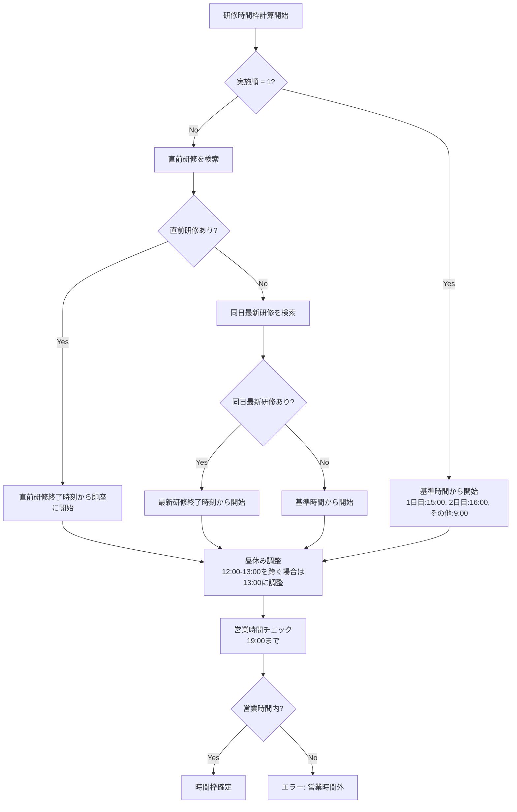
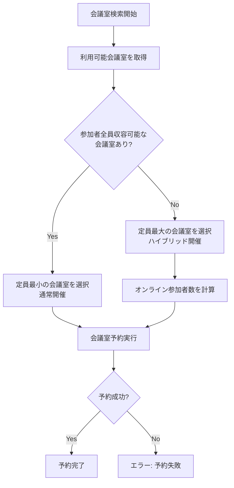
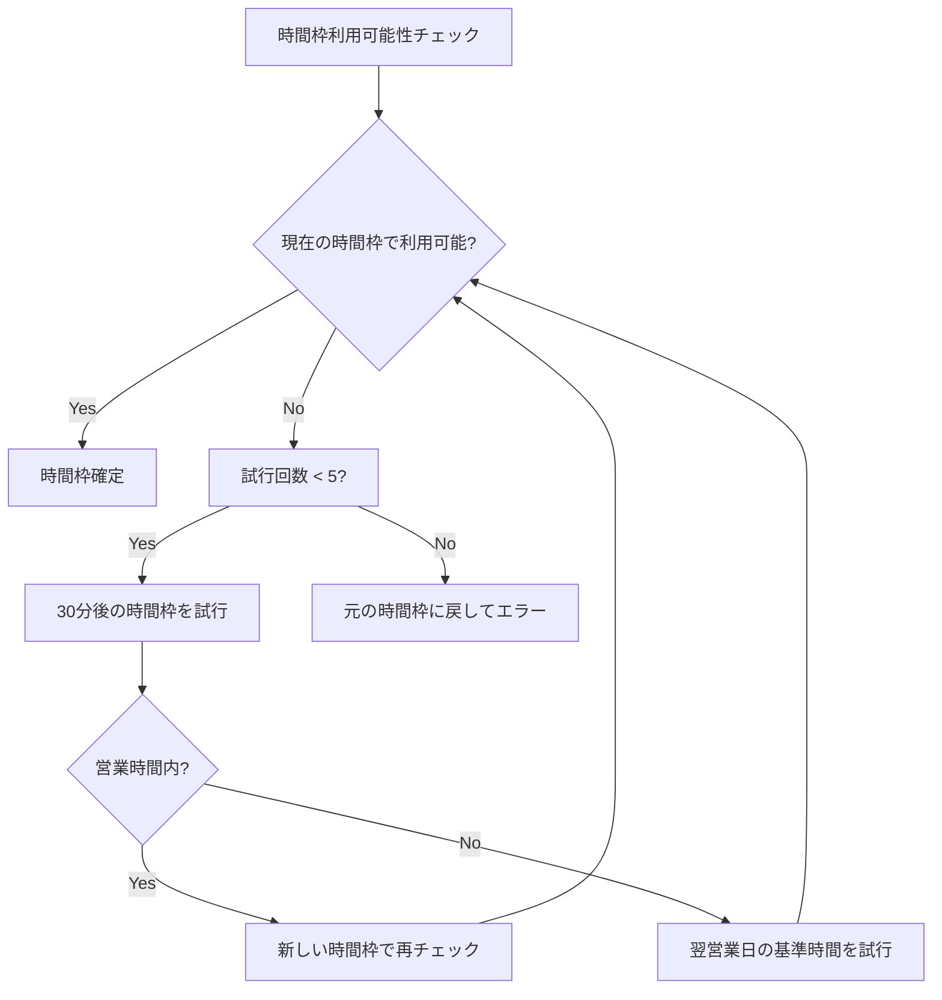
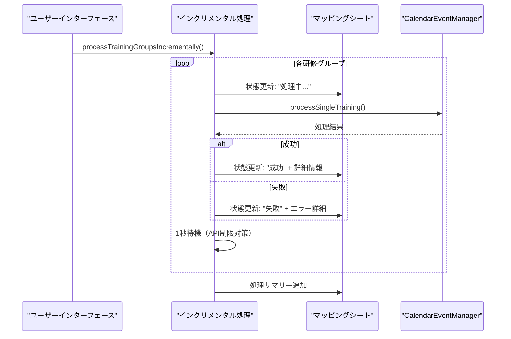
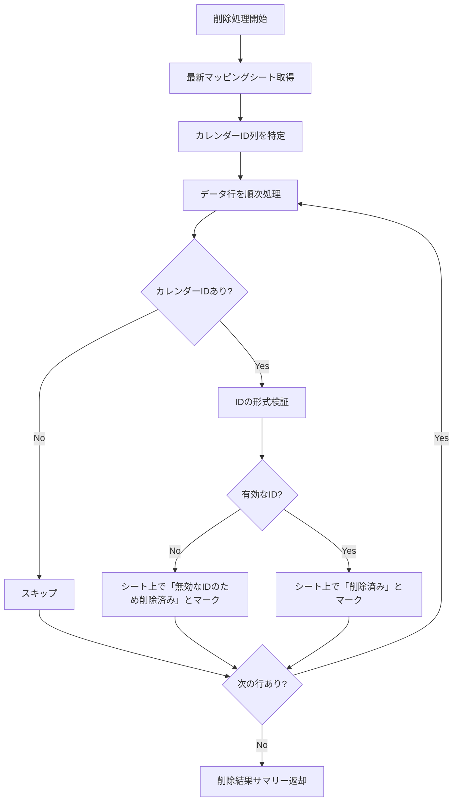

# GASを利用した研修カレンダー自動化システム

## 1. システム概要

### 1.1 目的
- Google Apps Script (GAS)を活用し、新入社員向け研修のGoogleカレンダー招待送付を自動化する
- ONB研修担当者の手動作業を削減し、業務プロセスを最適化することで作業効率を向上させる
- 送付漏れや誤った研修への招待といったヒューマンエラーを防ぎ、新入社員へ確実な研修案内を配信する

### 1.2 基本機能
- **研修パターンの自動判定**: 「入社者リスト」を参照し、入社者の職位と経験有無から参加すべき研修パターン（未経験者向け、経験者向けなど）を自動で判定する。
- **研修情報の自動マッピング**: 判定された研修パターンに基づき、「研修管理表マスタ」から対象となる研修を自動で特定する。
- **講師の空き時間を考慮した自動スケジューリング**: 担当講師のGoogleカレンダーの空き時間を検索し、重複を避けて研修日時を自動で設定する。
- **自動カレンダー招待送付**: 決定したスケジュールで、参加者（入社者＋講師）と会議室を含めたGoogleカレンダーの招待を自動で生成・送付する。
- **マッピング結果の可視化**: どの研修に誰が参加するかをまとめた「マッピング結果シート」を自動で生成し、実行結果を可視化する。
- **実行ログ記録と通知**: 自動化処理の実行履歴、結果（成功・失敗）、エラー詳細をログとして記録し、担当者にメールで通知する。

## 2. 前提条件と環境設定

### 2.1 Google Workspace設定
Google Workspaceアカウントを準備し、以下のサービスを有効化する：
- Google Calendar (API)
- Google Sheets (API)
- Google Apps Script
- Gmail (API)（通知用）

### 2.2 スプレッドシート構成
| シート名 | 使用シート | 列情報 | サンプルリンク |
|:---|:---|:---|:---|
| **DXS本部_入社者連携シート** | 入社者リスト | • **A列**: 職位 (必須)<br>• **B列**: 経験有無 (必須、「経験者」「未経験者」など)<br>• **C列**: 氏名 (必須)<br>• **D列**: メールアドレス用略称 (必須)<br>• **E列**: メールアドレス (必須)<br>※A〜E列が全て入力された行が処理対象 | [DXS本部_入社者連携シート](https://docs.google.com/spreadsheets/d/1BOfOUnIHotCLatJYKxDNNfndtptlC8NjoU7NoO2niAQ/edit?gid=332221570#gid=332221570) |
| **DXS本部_ONB研修マスタ** | 研修管理表マスタ | • **A列**: Lv.1 (「DX ONB」「ビジネススキル研修」を対象)<br>• **C列**: 研修名称<br>• **D-G列**: 対象パターン（A:未経験, B:経験C/SC, C:M, D:SMup などに「●」で指定）<br>• **H列**: 実施日（n営業日）<br>• **I列**: コンテンツ実施順<br>• **J列**: 時間（単位：分）<br>• **L列**: 担当者<br>• **N列**: メールアドレス<br>• **O列**: 会議室要否<br>• **P列**: カレンダーメモ | [DXS本部_ONB研修マスタ](https://docs.google.com/spreadsheets/d/1YNmiNiqSe7ctkHkW3qMOK7K13iodMixKs5WuDrMXsO8/edit?gid=696885769#gid=696885769) |
| **FLUX_六本木オフィス会議室マスタ** | 会議室マスタ | • **A列**: 会議室名<br>• **B列**: カレンダーID<br>• **C列**: 定員 | [FLUX_六本木オフィス会議室リスト](https://docs.google.com/spreadsheets/d/16xML66Ywi8Q5oFf8e5NEHdJrQPwkjUcJdswwXPxtnCQ/edit?gid=0#gid=0) |
| **DXS本部_ONB研修自動化_実行ファイル** | 実行シート | • **A列**: 実行者<br>• **B列**: 入社日<br>• **C列**: 処理結果<br>• **D列**: 詳細メッセージ<br>• **E列**: 実行日時 | [DXS本部_ONB研修自動化_実行ファイル](https://docs.google.com/spreadsheets/d/1o3JlRORxDgE6Hv2NyohB2uMRRlr1iSsOA8czmylUGxE/edit?gid=0#gid=0) |

## 3. システム構成

### 3.1 アーキテクチャ構成


### 3.2 データフロー

#### 3.2.1 システム処理フロー


#### 3.2.2 テキストベースの処理フロー
1.  **実行トリガー**
    -   ONB担当者が`実行シート`を開き、`B列: 入社日`を入力後、「実行」ボタンをクリックする。

2.  **データ読み込みと検証**
    -   GASは`入社者リスト`を参照し、必須項目（A列:職位, B列:経験有無, C列:氏名, D列:略称, E列:メアド）が全て入力されている行を取得する。
    -   必須項目に一つでも不備があれば、担当者にアラートを表示し、`実行シート`の`C列: 処理結果`に「データ不備エラー」と記録して処理を中断する。

3.  **研修情報のマッピング**
    -   GASは`研修管理表マスタ`を読み込み、`A列: Lv.1`が「DX ONB」または「ビジネススキル研修」の研修を抽出する。
    -   検証済みの入社者ごとに、`入社者リスト`の`A列: 職位`と`B列: 経験有無`を基に、参加すべき研修パターン（例: A, B, C, D）を内部的に決定する。
    -   各研修に設定されている対象パターン（`研修管理表マスタ`の`D-G列`の●印）と、各入社者のパターンを照合し、参加すべき研修を特定する。

4.  **研修グループの作成**
    -   研修ごとに、参加対象となる入社者と、`研修管理表マスタ`の`N列: 講師メールアドレス`を参加者としてグループ化する。
    -   各研修グループに、`C列: 研修名称`、`H列: 実施日（n営業日）`、`I列: コンテンツ実施順`、`J列: 時間`、`O列: 会議室要否`、`P列: カレンダーメモ`の情報を紐付ける。

5.  **マッピング結果シートの生成**
    -   カレンダー登録の前に、どの研修に誰が参加するかを一覧化した「マッピング結果」シートを`実行ファイル`スプレッドシート内に自動生成する。これにより、担当者は処理内容をひと目で確認できる。

6.  **カレンダーイベント作成と招待**
    -   研修グループを`H列: 実施日（n営業日）`の昇順、同日内では`I列: コンテンツ実施順`の昇順にソートして、一つずつ処理する。
    -   **日程決定**: `H列: 実施日（n営業日）`の値に基づき、入社日からn営業日後の日付を算出し、その日を基準に研修日程を設定する。
    -   **会議室検索**: `O列`が「必要」の場合、参加者（入社者＋講師）の合計人数に合う会議室を`会議室マスタ`から検索し、最も定員が近い会議室を確保する。
    -   **空き時間検索**: 講師のGoogleカレンダーの空き状況を、算出された実施日を基準として検索する。他の予定と重複しない、研修時間分の空きスロットを見つける。
    -   **イベント作成**: 見つかった空き時間と確保した会議室で、Google Calendar APIを介してイベントを作成し、参加者（入社者＋講師）に招待を送付する。カレンダーの説明には`P列: カレンダーメモ`の内容が記載される。

7.  **ログ記録と通知**
    -   全処理が正常に完了したら、`実行シート`に「成功」と記録し、担当者に完了通知メールを送信する。
    -   処理中にエラーが発生した場合は、その内容を`実行シート`に記録し、エラー通知メールを送信する。

#### 3.2.3 人事担当者の運用フロー


## 4. 実装仕様

### 4.1 GASスクリプト構成
今回の実装では、メンテナンス性と可読性を向上させるため、機能ごとにファイルを分割しています。

#### `Main.gs` - メイン処理
スクリプト全体の起点となるファイルです。UI（メニュー）の作成や、各モジュールを呼び出して処理全体を制御するメイン関数が含まれます。
- **`onOpen()`**: スプレッドシートを開いた時にカスタムメニューをUIに追加します。
- **`executeONBAutomation()`**: 実行ボタンから呼び出されるメイン関数。データ取得、検証、研修グループ化、マッピングシート生成、カレンダー作成、ログ記録、通知までの一連の処理フローを管理し、エラーハンドリングを行います。

#### `Constants.gs` - 定数管理
スプレッドシートのIDやシート名、通知先のメールアドレスなど、プロジェクト全体で共有される設定値を定数として管理します。
- `SPREADSHEET_IDS`
- `SHEET_NAMES`
- `NOTIFICATION_EMAIL`

#### `SheetUtils.gs` - スプレッドシート操作
Google Sheetsに対するデータの読み書きに特化したユーティリティ関数を管理します。
- **`getNewHires() : Array<Object>`**: `入社者リスト`から必須項目が全て入力された未処理のデータを取得します。
- **`logExecution(params: Object, status: string, message: string)`**: `実行シート`に処理結果のログを記録します。
- **`createMappingSheet(trainingGroups: Array<Object>, ...)`**: 研修の割り当て結果をまとめた「マッピング結果シート」を新規に作成します。
- **`updateStatuses(...)`**: (現在未使用) 過去バージョンで利用されていたステータス更新機能。

#### `Logic.gs` - ビジネスロジック
アプリケーションの中核となるロジック（データ検証、研修のマッピングなど）を担当します。
- **`validateNewHires(newHires: Array<Object>)`**: `入社者リスト`の必須項目が入力されているか検証します。
- **`determineTrainingPattern(rank: string, experience: string) : string`**: 職位と経験有無から、その入社者がどの研修パターン（A, B, C, Dなど）に属するかを判定します。
- **`groupTrainingsForHires(newHires: Array<Object>) : Array<Object>`**: `determineTrainingPattern`の結果と`研修管理表マスタ`を基に、研修ごとの参加者や詳細情報をグループ化します。

#### `CalendarUtils.gs` - カレンダー連携（リファクタリング版）
Google Calendarとの連携に特化したユーティリティ関数を管理します。リファクタリング版では、責任分離の原則に基づき、以下の4つの主要コンポーネントに分割されています：

**主要コンポーネント:**
- **SequenceManager**: 実施順管理システム（シングルトン）
- **TimeSlotCalculator**: 時間枠計算システム（シングルトン）
- **RoomManager**: 会議室管理システム（改良版）
- **CalendarEventManager**: カレンダーイベント管理システム（シングルトン）

**主要関数:**
- **`processTrainingGroupsIncrementally(trainingGroups, allNewHires, hireDate, mappingSheet)`**: 研修グループをインクリメンタルに処理してマッピングシートを更新します。
- **`deleteCalendarEventsFromMappingSheet()`**: マッピングシートから全カレンダーイベントを削除します（シート上でのマーク処理）。
- **`deleteSpecificTrainingEvent(trainingName)`**: 特定の研修に関連するカレンダーイベントを削除します。

**互換性関数:**
- **`createAllCalendarEvents_New(trainingGroups, hireDate)`**: 全ての研修グループについて、カレンダーイベントの作成を統括します。
- **`findAndReserveRoom_New(numberOfAttendees, startTime, endTime, trainingName)`**: 会議室を確保します。
- **`deleteSingleCalendarEvent_New(eventId)`**: 個別のカレンダーイベントを削除します。

#### `NotificationUtils.gs` - 通知処理
メール通知や詳細なログ出力に関する処理を専門に担当します。
- **`sendNotificationEmail(subject: string, body: string)`**: 担当者へ処理結果（成功・エラー）の通知メールを送信します。
- **`writeLog(level, message, ...)`**: 実行ログ（Google Cloud Logs）に詳細なトレース情報を記録します。

#### 4.1.1 関数呼び出しフロー
`executeONBAutomation`関数が各モジュールの関数を呼び出す流れを以下に示します。



### 4.2 エラーハンドリング
- try-catch文による例外処理を`Main.gs`の`executeONBAutomation`に実装する。
- データ不備、会議室の空き無し、APIエラー、講師の空き時間が見つからない場合など、予期されるエラーは個別のメッセージでハンドリングし、ログとメールで担当者に通知する。
- 処理の実行履歴とエラー内容を「DXS本部_ONB研修自動化_実行ファイル」にログとして保存する。
- 部分的な失敗が発生した場合でも、生成された「マッピング結果シート」を元に手動で補完できる運用を想定する。

### 4.3 カレンダー関連実装詳細

#### 4.3.1 アーキテクチャ設計

リファクタリング版のCalendarUtils.gsは、以下の設計原則に基づいて実装されています：



#### 4.3.2 実施順管理システム（SequenceManager）

**目的**: 研修の実施順序を管理し、詰め配置による効率的なスケジューリングを実現

**主要機能**:
- **`reset()`**: スケジュール配列をリセット
- **`addTraining(training)`**: 研修を実施順に追加（自動ソート）
- **`getPreviousTraining(implementationDay, sequence)`**: 直前の研修情報を取得
- **`getLatestTrainingInDay(implementationDay)`**: 指定実施日の最新研修を取得
- **`logCurrentSchedule()`**: 現在のスケジュール状況をログ出力

**実装例**:
```javascript
var sequenceManager = SequenceManager.getInstance();
sequenceManager.reset();
sequenceManager.addTraining({
    name: '【DX オンボ】 ONBキックオフ（C/SC）',
    implementationDay: 1,
    sequence: 1,
    startTime: new Date('2024-06-16 15:00'),
    endTime: new Date('2024-06-16 16:00')
});
```

#### 4.3.3 時間枠計算システム（TimeSlotCalculator）

**目的**: 営業日ベースの日付計算と実施順に基づく詰め配置時間計算

**主要機能**:
- **`calculateTimeSlot(trainingGroup, hireDate)`**: 研修の適切な時間枠を計算
- **`extractDurationMinutes(timeString)`**: 研修時間文字列から分数を抽出
- **`calculateImplementationDate(hireDate, businessDays)`**: 入社日から実施日を計算
- **`calculateSequenceBasedStartTime(targetDate, implementationDay, sequence, baseStartTime)`**: 実施順に基づく開始時間を計算
- **`adjustForLunchTime(targetDate, startTime)`**: 昼休み時間の調整
- **`isWithinBusinessHours(endTime)`**: 営業時間内チェック

**詰め配置ロジック**:


#### 4.3.4 会議室管理システム（RoomManager）

**目的**: 会議室の予約管理と重複チェック、ハイブリッド開催対応

**主要機能**:
- **`reset()`**: 予約をリセット
- **`reserveRoom(roomInfo, startTime, endTime, trainingName)`**: 会議室を予約
- **`isRoomAvailable(roomName, startTime, endTime)`**: 会議室の利用可能性をチェック
- **`findAndReserveRoom(numberOfAttendees, startTime, endTime, trainingName)`**: 適切な会議室を検索・予約
- **`getAvailableRooms(startTime, endTime)`**: 利用可能な会議室を取得
- **`isGoogleCalendarRoomAvailable(calendarId, startTime, endTime)`**: Googleカレンダーでの会議室可用性チェック

**会議室選択ロジック**:


#### 4.3.5 カレンダーイベント管理システム（CalendarEventManager）

**目的**: カレンダーイベントの作成、削除、参加者管理

**主要機能**:
- **`createAllCalendarEvents(trainingGroups, hireDate)`**: 全研修のカレンダーイベントを作成
- **`processSingleTraining(trainingGroup, hireDate)`**: 単一研修を処理
- **`isTimeSlotAvailable(startTime, endTime, trainingGroup)`**: 時間枠の利用可能性をチェック
- **`isLecturerAvailable(lecturerEmail, startTime, endTime)`**: 講師の空き時間チェック
- **`createSingleCalendarEvent(trainingDetails, roomReservation, startTime, endTime)`**: 単一カレンダーイベントを作成
- **`deleteSingleCalendarEvent(eventId)`**: カレンダーイベントを削除

**フォールバック検索機能**:


#### 4.3.6 インクリメンタル処理システム

**目的**: リアルタイムでのマッピングシート更新とプログレス表示

**主要機能**:
- **`processTrainingGroupsIncrementally(trainingGroups, allNewHires, hireDate, mappingSheet)`**: 研修グループをインクリメンタルに処理
- **`updateMappingSheetRow(mappingSheet, rowIndex, updates)`**: マッピングシートの特定行を更新
- **`addProcessingSummary(mappingSheet, totalCount, successCount, errorCount, newHires, trainingGroups)`**: 処理サマリーをシートに追加

**処理フロー**:


#### 4.3.7 カレンダー削除機能

**目的**: 安全なカレンダーイベント削除とシート上での状態管理

**主要機能**:
- **`deleteCalendarEventsFromMappingSheet()`**: マッピングシートから全カレンダーイベントを削除
- **`deleteSpecificTrainingEvent(trainingName)`**: 特定の研修に関連するカレンダーイベントを削除
- **`getMostRecentMappingSheet()`**: 最新のマッピングシートを取得

**安全な削除処理**:


**注意**: 実際のGoogle Calendar APIは呼び出さず、シート上でのみ削除済み状態をマークします。これにより、無効なカレンダーIDによるエラーを回避し、安全な削除処理を実現しています。

#### 4.3.8 エラーハンドリングと復旧機能

**主要なエラーパターンと対応**:

1. **無効なカレンダーID**: シート上で「無効なIDのため削除済み」とマーク
2. **講師カレンダーアクセス不可**: 空き時間とみなして処理継続
3. **会議室不足**: ハイブリッド開催に自動切り替え
4. **時間枠重複**: フォールバック検索で代替時間を自動探索
5. **営業時間外**: 翌営業日への自動調整

**ログレベル**:
- **INFO**: 正常な処理フロー
- **DEBUG**: 詳細なトレース情報
- **WARN**: 警告（処理は継続）
- **ERROR**: エラー（処理中断の可能性）

#### 4.3.9 パフォーマンス最適化

**最適化手法**:
1. **シングルトンパターン**: 管理システムのインスタンス再利用
2. **バッチ処理**: 複数の研修を一括処理
3. **API制限対策**: 処理間に1秒の待機時間
4. **キャッシュ機能**: 会議室情報の一時保存
5. **並列処理回避**: Google Apps Scriptの制限に配慮した順次処理

**処理時間の目安**:
- 研修1件あたり: 約2-3秒
- 10件の研修: 約20-30秒
- 20件の研修: 約40-60秒

## 5. セキュリティ設定

### 5.1 アクセス制御
- スプレッドシートの共有設定: 閲覧・編集権限をONB研修担当者など、必要な人員に限定する
- スクリプトの実行権限: 実行権限を持つユーザーの範囲（担当者のみか、管理者も含むか）を定義する
- Google Workspaceの権限: Google Calendar APIなどを利用するための権限を適切に設定する

### 5.2 データ保護
- 個人情報の取り扱い: 新入社員の氏名やメールアドレスなどの個人情報を適切に取り扱う
- ログの管理: 実行ログやエラーログの保存期間と確認方法を定め、適切に管理する

## 6. 運用管理

### 6.1 モニタリング
- 実行ログの確認: 自動化処理の実行履歴と結果（成功、エラー）を「DXS本部_ONB研修自動化_実行ファイル」で確認する。
- エラー通知: エラー発生時には、メールなどの手段で担当者や管理者に通知する
- 処理状況の確認: 担当者は処理実行後、入社者連携シートで招待状況（「済」マーク）を確認する

### 6.2 メンテナンス
- マスターデータの更新: ONB管理表の研修情報（対象者、日程など）を常に最新の状態に保つ
- データ品質の管理: 自動化の前提となる入社者連携シートの情報（特にメールアドレス、役職レベル）が正確に入力されていることを確認する
- 代替手順の準備: システム停止時などに備え、手動で処理を行う代替手順を文書化しておく

## 7. 今後の拡張性

### 7.1 機能拡張
- AI活用の研修推奨: 入社者のスキルや経歴に基づき、個別の研修プランを自動で提案する
- 研修効果分析: 研修の参加率、完了率、満足度などを自動で集計し、レポートを生成する
- モバイル対応: スマートフォンからシステムの実行や状況確認ができる機能を追加する
- リマインダー機能: 研修前に参加者へリマインダーメールを自動で送信する

### 7.2 インテグレーション
- 人事システム連携: 人事システムと連携し、入社者情報を自動で取得する
- LMS連携: 学習管理システム（LMS）と連携し、研修の進捗管理を自動化する
- チャットツール連携: Slackなどと連携し、エラー通知や完了報告を送信する


