# GASを利用した研修カレンダー自動化システム

## 目次
- [GASを利用した研修カレンダー自動化システム](#gasを利用した研修カレンダー自動化システム)
  - [目次](#目次)
  - [1. システム概要](#1-システム概要)
    - [1.1 目的](#11-目的)
    - [1.2 基本機能](#12-基本機能)
  - [2. 前提条件と環境設定](#2-前提条件と環境設定)
    - [2.1 Google Workspace設定](#21-google-workspace設定)
    - [2.2 スプレッドシート構成](#22-スプレッドシート構成)
  - [3. システム構成](#3-システム構成)
    - [3.1 アーキテクチャ構成](#31-アーキテクチャ構成)
    - [3.2 データフロー](#32-データフロー)
      - [3.2.1 システム処理フロー](#321-システム処理フロー)
      - [3.2.2 テキストベースの処理フロー](#322-テキストベースの処理フロー)
      - [3.2.3 人事担当者の運用フロー](#323-人事担当者の運用フロー)
  - [4. 実装仕様](#4-実装仕様)
    - [4.1 GASスクリプト構成](#41-gasスクリプト構成)
      - [`Main.gs` - メイン処理](#maings---メイン処理)
      - [`Constants.gs` - 定数管理](#constantsgs---定数管理)
      - [`SheetUtils.gs` - スプレッドシート操作](#sheetutilsgs---スプレッドシート操作)
      - [`Logic.gs` - ビジネスロジック](#logicgs---ビジネスロジック)
      - [`CalendarUtils.gs` - カレンダー連携](#calendarutilsgs---カレンダー連携)
      - [`NotificationUtils.gs` - 通知処理](#notificationutilsgs---通知処理)
      - [4.1.1 関数呼び出しフロー](#411-関数呼び出しフロー)
    - [4.2 エラーハンドリング](#42-エラーハンドリング)
    - [4.3 カレンダー関連実装詳細](#43-カレンダー関連実装詳細)
      - [4.3.1 アーキテクチャ設計](#431-アーキテクチャ設計)
      - [4.3.2 実施順管理システム（SequenceManager）](#432-実施順管理システムsequencemanager)
      - [4.3.3 時間枠計算システム（TimeSlotCalculator）](#433-時間枠計算システムtimeslotcalculator)
      - [4.3.4 会議室管理システム（RoomManager）](#434-会議室管理システムroommanager)
      - [4.3.5 カレンダーイベント管理システム（CalendarEventManager）](#435-カレンダーイベント管理システムcalendareventmanager)
      - [4.3.6 インクリメンタル処理システム](#436-インクリメンタル処理システム)
      - [4.3.7 カレンダー削除機能](#437-カレンダー削除機能)
      - [4.3.8 エラーハンドリングと復旧機能](#438-エラーハンドリングと復旧機能)
      - [4.3.9 ログレベルと監視](#439-ログレベルと監視)
    - [4.4 スプレッドシートID管理の統一](#44-スプレッドシートid管理の統一)
  - [5. セキュリティ設定](#5-セキュリティ設定)
    - [5.1 アクセス制御](#51-アクセス制御)
    - [5.2 データ保護](#52-データ保護)
  - [6. 運用管理](#6-運用管理)
    - [6.1 モニタリング](#61-モニタリング)
    - [6.2 メンテナンス](#62-メンテナンス)
  - [7. 今後の拡張性](#7-今後の拡張性)
    - [7.1 機能拡張](#71-機能拡張)
    - [7.2 インテグレーション](#72-インテグレーション)
  - [8. 運用担当者向け簡易ガイド](#8-運用担当者向け簡易ガイド)
    - [8.1 まずはこれだけチェック](#81-まずはこれだけチェック)
    - [8.2 実行ステップ（所要時間：10〜60秒）](#82-実行ステップ所要時間1060秒)
    - [8.3 よくあるエラーと対処法](#83-よくあるエラーと対処法)
    - [8.4 処理ルール（覚えておくと便利！）](#84-処理ルール覚えておくと便利)
    - [8.5 困ったら…](#85-困ったら)
    - [8.6 カレンダー登録のしくみ（かんたん解説）](#86-カレンダー登録のしくみかんたん解説)
      - [フローチャート](#フローチャート)
      - [詳細ステップ](#詳細ステップ)

---

## 1. システム概要

### 1.1 目的
- Google Apps Script (GAS)を活用し、新入社員向け研修のGoogleカレンダー招待送付を自動化する
- ONB研修担当者の手動作業を削減し、業務プロセスを最適化することで作業効率を向上させる
- 送付漏れや誤った研修への招待といったヒューマンエラーを防ぎ、新入社員へ確実な研修案内を配信する

### 1.2 基本機能
- **研修パターンの自動判定**: 「入社者リスト」を参照し、入社者の職位と経験有無から参加すべき研修パターン（未経験者向け、経験者向けなど）を自動で判定する。
- **研修情報の自動マッピング**: 判定された研修パターンに基づき、「研修管理表マスタ」から対象となる研修を自動で特定する。
- **講師の空き時間を考慮した自動スケジューリング**: 担当講師のGoogleカレンダーの空き時間を検索し、重複を避けて研修日時を自動で設定する。
- **自動カレンダー招待送付**: 決定したスケジュールで、参加者（入社者＋講師）と会議室を含めたGoogleカレンダーの招待を自動で生成・送付する。
- **マッピング結果の可視化**: どの研修に誰が参加するかをまとめた「マッピング結果シート」を自動で生成し、実行結果を可視化する。
- **実行ログ記録と通知**: 自動化処理の実行履歴、結果（成功・失敗）、エラー詳細をログとして記録し、担当者にメールで通知する。

---

## 2. 前提条件と環境設定

### 2.1 Google Workspace設定
Google Workspaceアカウントを準備し、以下のサービスを有効化する：
- Google Calendar (API)
- Google Sheets (API)
- Google Apps Script
- Gmail (API)（通知用）

### 2.2 スプレッドシート構成
| シート名 | 使用シート | 列情報 | サンプルリンク |
|:---|:---|:---|:---|
| **DXS本部_入社者連携シート** | 入社者リスト | • **A列**: 職位 (必須)<br>• **B列**: 経験有無 (必須、「経験者」「未経験者」など)<br>• **C列**: 氏名 (必須)<br>• **D列**: メールアドレス (必須)<br>• **E列**: 所属 (必須)<br>• **F列**: 入社日 (必須)<br>※A〜F列が全て入力された行が処理対象 | [DXS本部_入社者連携シート](https://docs.google.com/spreadsheets/d/1BOfOUnIHotCLatJYKxDNNfndtptlC8NjoU7NoO2niAQ/edit?gid=332221570#gid=332221570) |
| **DXS本部_ONB研修マスタ** | 研修管理表マスタ | • **A列**: Lv.1 (「DX ONB」「ビジネススキル研修」を対象)<br>• **C列**: 研修名称<br>• **D-G列**: 対象パターン（A:未経験, B:経験C/SC, C:M, D:SMup などに「●」で指定）<br>• **H列**: 実施日（n営業日）<br>• **I列**: コンテンツ実施順<br>• **J列**: 時間（単位：分）<br>• **L列**: 講師1:担当者<br>• **M列**: 講師1:メールアドレス<br>• **N列**: 講師2:担当者<br>• **O列**: 講師2:メールアドレス<br>• **P列**: 会議室要否<br>• **Q列**: カレンダーメモ | [DXS本部_ONB研修マスタ](https://docs.google.com/spreadsheets/d/1YNmiNiqSe7ctkHkW3qMOK7K13iodMixKs5WuDrMXsO8/edit?gid=696885769#gid=696885769) |
| **FLUX_六本木オフィス会議室マスタ** | 会議室マスタ | • **A列**: 会議室名<br>• **B列**: カレンダーID<br>• **C列**: 定員 | [FLUX_六本木オフィス会議室リスト](https://docs.google.com/spreadsheets/d/16xML66Ywi8Q5oFf8e5NEHdJrQPwkjUcJdswwXPxtnCQ/edit?gid=0#gid=0) |
| **DXS本部_ONB研修自動化_実行ファイル** | 実行シート | • **A列**: 実行者<br>• **B列**: 入社日<br>• **C列**: 処理結果<br>• **D列**: 詳細メッセージ<br>• **E列**: 実行日時 | [DXS本部_ONB研修自動化_実行ファイル](https://docs.google.com/spreadsheets/d/1o3JlRORxDgE6Hv2NyohB2uMRRlr1iSsOA8czmylUGxE/edit?gid=0#gid=0) |


---

## 3. システム構成

### 3.1 アーキテクチャ構成
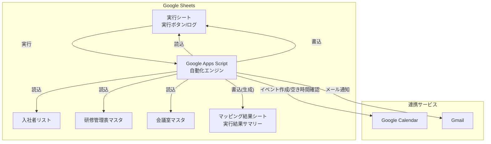

### 3.2 データフロー

#### 3.2.1 システム処理フロー
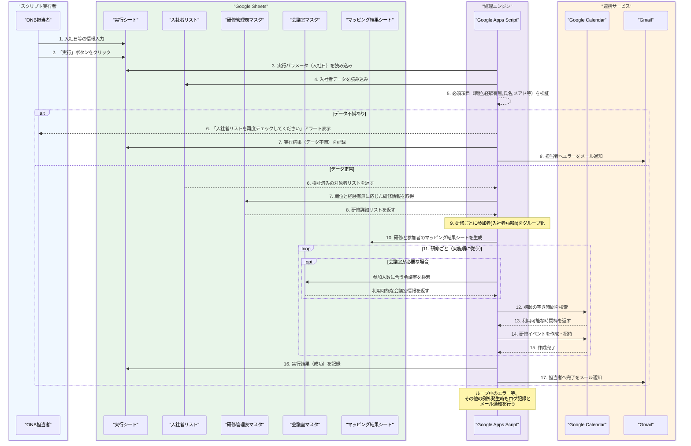

#### 3.2.2 テキストベースの処理フロー
1.  **実行トリガー**
    -   ONB担当者が`実行シート`を開き、`B列: 入社日`を入力後、「実行」ボタンをクリックする。

2.  **データ読み込みと検証**
    -   GASは`入社者リスト`を参照し、必須項目（A列:職位, B列:経験有無, C列:氏名, D列:メールアドレス, E列:所属, F列:入社日）が全て入力されている行を取得する。
    -   必須項目に一つでも不備があれば、担当者にアラートを表示し、`実行シート`の`C列: 処理結果`に「データ不備エラー」と記録して処理を中断する。

3.  **研修情報のマッピング**
    -   GASは`研修管理表マスタ`を読み込み、`A列: Lv.1`が「DX ONB」または「ビジネススキル研修」の研修を抽出する。
    -   検証済みの入社者ごとに、`入社者リスト`の`A列: 職位`と`B列: 経験有無`を基に、参加すべき研修パターン（例: A, B, C, D）を内部的に決定する。
    -   各研修に設定されている対象パターン（`研修管理表マスタ`の`D-G列`の●印）と、各入社者のパターンを照合し、参加すべき研修を特定する。

4.  **研修グループの作成**
    -   研修ごとに、参加対象となる入社者に加え、`研修管理表マスタ`に設定された講師（`M列: 講師1メールアドレス`, `O列: 講師2メールアドレス`）を参加者としてグループ化する。
    -   各研修グループに、`C列: 研修名称`、`H列: 実施日（n営業日）`、`I列: コンテンツ実施順`、`J列: 時間`、`P列: 会議室要否`、`Q列: カレンダーメモ`の情報を紐付ける。

5.  **マッピング結果シートの生成**
    -   カレンダー登録の前に、どの研修に誰が参加するかを一覧化した「マッピング結果」シート（インクリメンタル版）を`実行ファイル`スプレッドシート内に自動生成する。
    -   シートには「処理状況」「カレンダーID」「エラー詳細」列が含まれ、各研修グループの処理進行に合わせて行単位でリアルタイム更新される。

6.  **カレンダーイベント作成と招待**
    -   研修グループを`H列: 実施日（n営業日）`の昇順、同日内では`I列: コンテンツ実施順`の昇順にソートし、`processTrainingGroupsIncrementally`で一件ずつ処理する。
    -   **日程決定**: `H列: 実施日（n営業日）`の値に基づき、入社日からn営業日後の日付を算出し、その日を基準に研修日程を設定する。
    -   **会議室検索**: `P列`が「必要」の場合、参加者（入社者＋講師）の合計人数に合う会議室を`会議室マスタ`から検索し、最も定員が近い会議室を確保する。
    -   **空き時間検索**: 講師のGoogleカレンダーの空き状況を、算出された実施日を基準として検索する。他の予定と重複しない、研修時間分の空きスロットを見つける。
    -   **イベント作成**: 見つかった空き時間と確保した会議室で、Google Calendar APIを介してイベントを作成し、参加者（入社者＋講師）に招待を送付する。カレンダーの説明には`Q列: カレンダーメモ`の内容が記載される。
    -   **ステータス更新**: 研修グループごとに処理が完了するたび、マッピングシートの対象行を「成功」または「失敗」に更新し、エラーがあれば「エラー詳細」列にスタックトレースを記録する。

7.  **ログ記録と通知**
    -   全処理が正常に完了したら、`実行シート`に「成功」と記録し、担当者に完了通知メールを送信する。
    -   処理中にエラーが発生した場合は、その内容を`実行シート`に記録し、エラー通知メールを送信する。

#### 3.2.3 人事担当者の運用フロー
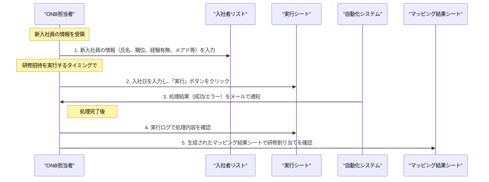

---

## 4. 実装仕様

### 4.1 GASスクリプト構成
今回の実装では、メンテナンス性と可読性を向上させるため、機能ごとにファイルを分割しています。

#### `Main.gs` - メイン処理
スクリプト全体の起点となるファイルです。UI（メニュー）の作成や、各モジュールを呼び出して処理全体を制御するメイン関数が含まれます。
- **`onOpen()`**: スプレッドシートを開いた時にカスタムメニューをUIに追加します。
- **`executeONBAutomation()`**: 実行ボタンから呼び出されるメイン関数。データ取得、検証、研修グループ化、マッピングシート生成、カレンダー作成、ログ記録、通知までの一連の処理フローを管理し、エラーハンドリングを行います。

#### `Constants.gs` - 定数管理
スプレッドシートのIDやシート名、通知先のメールアドレスなど、プロジェクト全体で共有される設定値を定数として管理します。
- `SPREADSHEET_IDS`
- `SHEET_NAMES`
- `NOTIFICATION_EMAIL`

#### `SheetUtils.gs` - スプレッドシート操作
Google Sheetsに対するデータの読み書きに特化したユーティリティ関数を管理します。
- **`getNewHires() : Array<Object>`**: `入社者リスト`から必須項目が全て入力された未処理のデータを取得します。
- **`logExecution(params: Object, status: string, message: string)`**: `実行シート`に処理結果のログを記録します。
- **`createIncrementalMappingSheet(trainingGroups: Array<Object>, ...)`**: インクリメンタル実行に対応した「マッピング結果」シートを新規に作成します（処理状況/エラー詳細列を自動付与）。
- **`updateMappingSheetRow(mappingSheet, rowIndex, updates)`**: 研修グループ処理中に対象行の「処理状況」や「カレンダーID」等を随時更新します.
- **`updateStatuses(...)`**: (現在未使用) 過去バージョンで利用されていたステータス更新機能。

#### `Logic.gs` - ビジネスロジック
アプリケーションの中核となるロジック（データ検証、研修のマッピングなど）を担当します。
- **`validateNewHires(newHires: Array<Object>)`**: `入社者リスト`の必須項目が入力されているか検証します。
- **`determineTrainingPattern(rank: string, experience: string) : string`**: 職位と経験有無から、その入社者がどの研修パターン（A, B, C, Dなど）に属するかを判定します。
- **`groupTrainingsForHires(newHires: Array<Object>) : Array<Object>`**: `determineTrainingPattern`の結果と`研修管理表マスタ`を基に、研修ごとの参加者や詳細情報をグループ化します。

#### `CalendarUtils.gs` - カレンダー連携
Google Calendarとの連携に特化したユーティリティ関数を管理します。責任分離の原則に基づき、以下の4つの主要コンポーネントに分割されています：

**主要コンポーネント:**
- **SequenceManager**: 実施順管理システム（シングルトン）
- **TimeSlotCalculator**: 時間枠計算システム（シングルトン）
- **RoomManager**: 会議室管理システム（改良版）
- **CalendarEventManager**: カレンダーイベント管理システム（シングルトン）

**主要関数:**
- **`processTrainingGroupsIncrementally(trainingGroups, allNewHires, hireDate, mappingSheet)`**: 研修グループをインクリメンタルに処理してマッピングシートを更新します。
- **`deleteCalendarEventsFromMappingSheet()`**: マッピングシートから全カレンダーイベントを削除します（シート上でのマーク処理）。
- **`deleteSpecificTrainingEvent(trainingName)`**: 特定の研修に関連するカレンダーイベントを削除します。

**互換性関数:**
- **`createAllCalendarEvents_New(trainingGroups, hireDate)`**: 全ての研修グループについて、カレンダーイベントの作成を統括します。
- **`findAndReserveRoom_New(numberOfAttendees, startTime, endTime, trainingName)`**: 会議室を確保します。
- **`deleteSingleCalendarEvent_New(eventId)`**: 個別のカレンダーイベントを削除します。

#### `NotificationUtils.gs` - 通知処理
メール通知や詳細なログ出力に関する処理を専門に担当します。
- **`sendNotificationEmail(subject: string, body: string)`**: 担当者へ処理結果（成功・エラー）の通知メールを送信します。
- **`writeLog(level, message, ...)`**: 実行ログ（Google Cloud Logs）に詳細なトレース情報を記録します。

#### 4.1.1 関数呼び出しフロー
`executeONBAutomation`関数が各モジュールの関数を呼び出す流れを以下に示します。

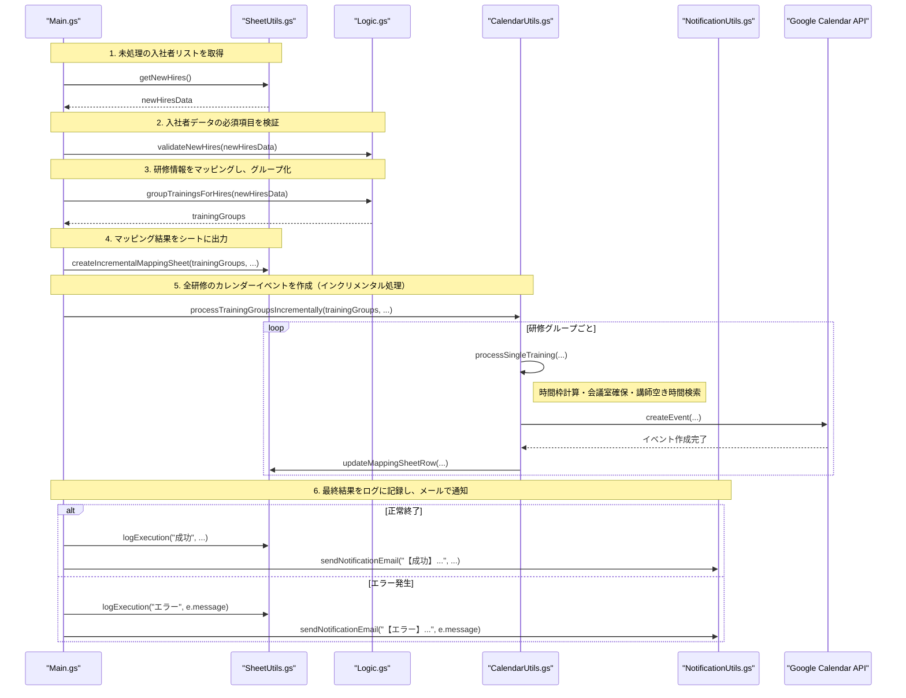

### 4.2 エラーハンドリング
- try-catch文による例外処理を`Main.gs`の`executeONBAutomation`に実装する。
- データ不備、会議室の空き無し、APIエラー、講師の空き時間が見つからない場合など、予期されるエラーは個別のメッセージでハンドリングし、ログとメールで担当者に通知する。
- 処理の実行履歴とエラー内容を「DXS本部_ONB研修自動化_実行ファイル」にログとして保存する。
- 部分的な失敗が発生した場合でも、生成された「マッピング結果シート」を元に手動で補完できる運用を想定する。

### 4.3 カレンダー関連実装詳細

#### 4.3.1 アーキテクチャ設計

CalendarUtils.gsは、以下の設計原則に基づいて実装されています：

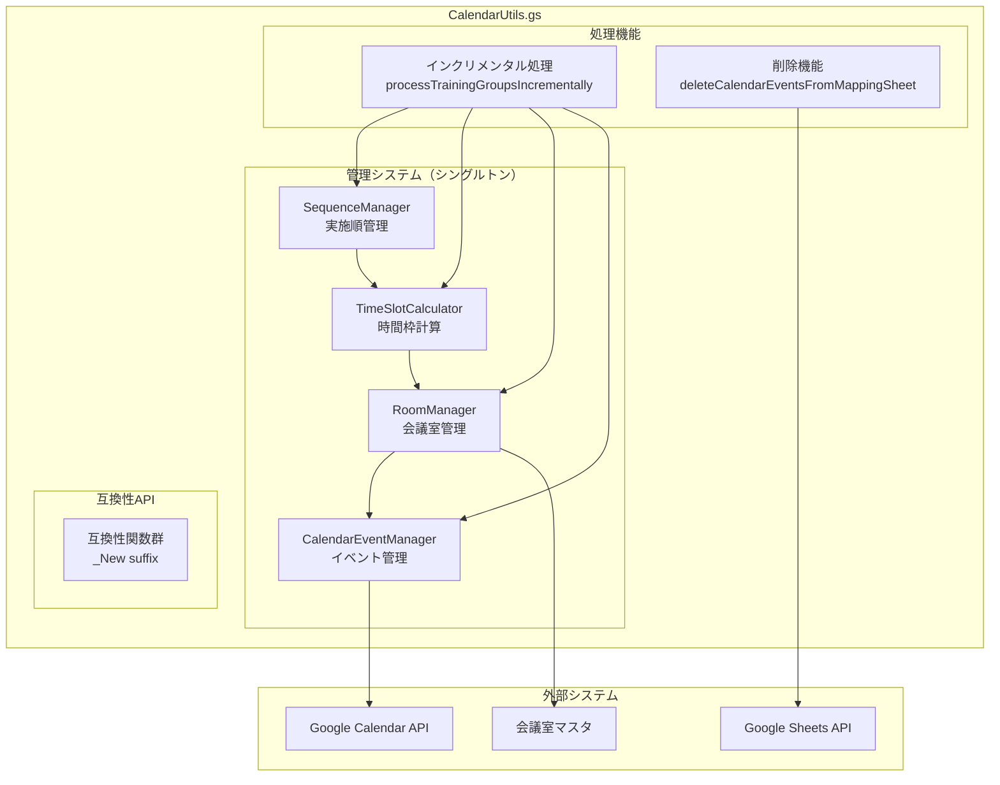

#### 4.3.2 実施順管理システム（SequenceManager）

**目的**: 研修の実施順序を管理し、詰め配置による効率的なスケジューリングを実現

**主要機能**:
- **`reset()`**: スケジュール配列をリセット
- **`addTraining(training)`**: 研修を実施順に追加（自動ソート）
- **`getPreviousTraining(implementationDay, sequence)`**: 直前の研修情報を取得
- **`getLatestTrainingInDay(implementationDay)`**: 指定実施日の最新研修を取得
- **`logCurrentSchedule()`**: 現在のスケジュール状況をログ出力

**実装例**:
```javascript
var sequenceManager = SequenceManager.getInstance();
sequenceManager.reset();
sequenceManager.addTraining({
    name: '【DX オンボ】 ONBキックオフ（C/SC）',
    implementationDay: 1,
    sequence: 1,
    startTime: new Date('2024-06-16 15:00'),
    endTime: new Date('2024-06-16 16:00')
});
```

#### 4.3.3 時間枠計算システム（TimeSlotCalculator）

**目的**: 営業日ベースの日付計算と実施順に基づく詰め配置時間計算

**主要機能**:
- **`calculateTimeSlot(trainingGroup, hireDate)`**: 研修の適切な時間枠を計算
- **`extractDurationMinutes(timeString)`**: 研修時間文字列から分数を抽出
- **`calculateImplementationDate(hireDate, businessDays)`**: 入社日から実施日を計算
- **`calculateSequenceBasedStartTime(targetDate, implementationDay, sequence, baseStartTime)`**: 実施順に基づく開始時間を計算
- **`adjustForLunchTime(targetDate, startTime)`**: 昼休み時間の調整
- **`isWithinBusinessHours(endTime)`**: 営業時間内チェック

**詰め配置ロジック**:
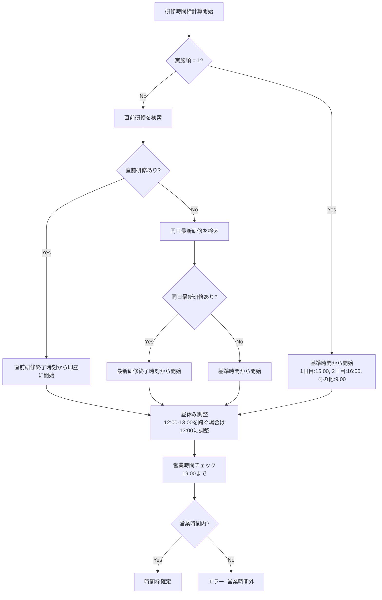

#### 4.3.4 会議室管理システム（RoomManager）

**目的**: 会議室の予約管理と重複チェック、ハイブリッド開催対応

**主要機能**:
- **`reset()`**: 予約をリセット
- **`reserveRoom(roomInfo, startTime, endTime, trainingName)`**: 会議室を予約
- **`isRoomAvailable(roomName, startTime, endTime)`**: 会議室の利用可能性をチェック
- **`findAndReserveRoom(numberOfAttendees, startTime, endTime, trainingName)`**: 適切な会議室を検索・予約
- **`getAvailableRooms(startTime, endTime)`**: 利用可能な会議室を取得
- **`isGoogleCalendarRoomAvailable(calendarId, startTime, endTime)`**: Googleカレンダーでの会議室可用性チェック

**会議室選択ロジック**:
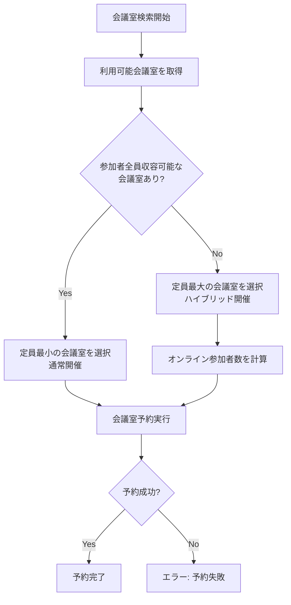

#### 4.3.5 カレンダーイベント管理システム（CalendarEventManager）

**目的**: カレンダーイベントの作成、削除、参加者管理

**主要機能**:
- **`createAllCalendarEvents(trainingGroups, hireDate)`**: 全研修のカレンダーイベントを作成
- **`processSingleTraining(trainingGroup, hireDate)`**: 単一研修を処理
- **`isTimeSlotAvailable(startTime, endTime, trainingGroup)`**: 時間枠の利用可能性をチェック
- **`isLecturerAvailable(lecturerEmail, startTime, endTime)`**: 講師の空き時間チェック
- **`createSingleCalendarEvent(trainingDetails, roomReservation, startTime, endTime)`**: 単一カレンダーイベントを作成
- **`deleteSingleCalendarEvent(eventId)`**: カレンダーイベントを削除

**フォールバック検索機能**:
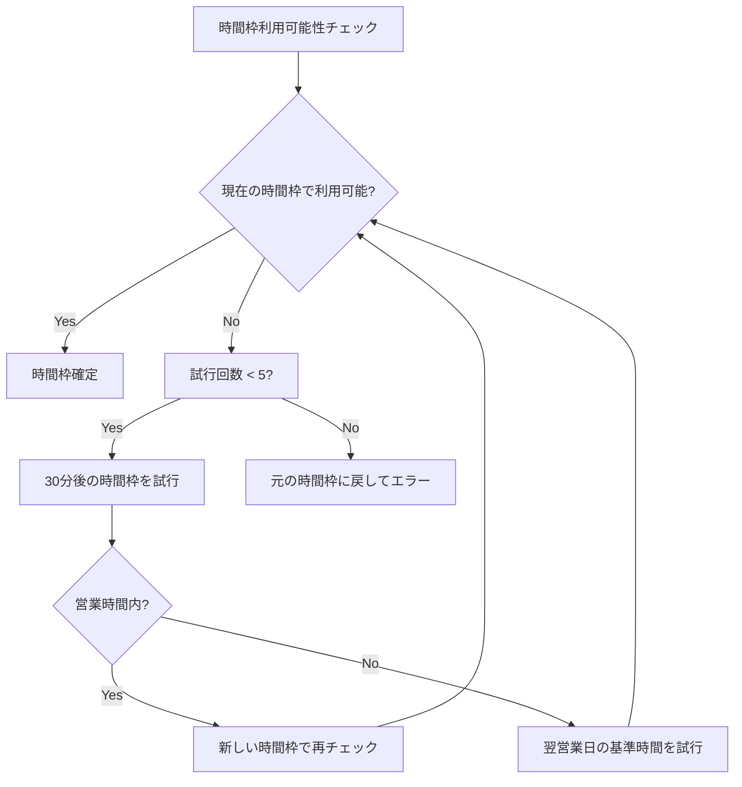

#### 4.3.6 インクリメンタル処理システム

**目的**: リアルタイムでのマッピングシート更新とプログレス表示

**主要機能**:
- **`processTrainingGroupsIncrementally(trainingGroups, allNewHires, hireDate, mappingSheet)`**: 研修グループをインクリメンタルに処理
- **`updateMappingSheetRow(mappingSheet, rowIndex, updates)`**: マッピングシートの特定行を更新
- **`addProcessingSummary(mappingSheet, totalCount, successCount, errorCount, newHires, trainingGroups)`**: 処理サマリーをシートに追加

**処理フロー**:
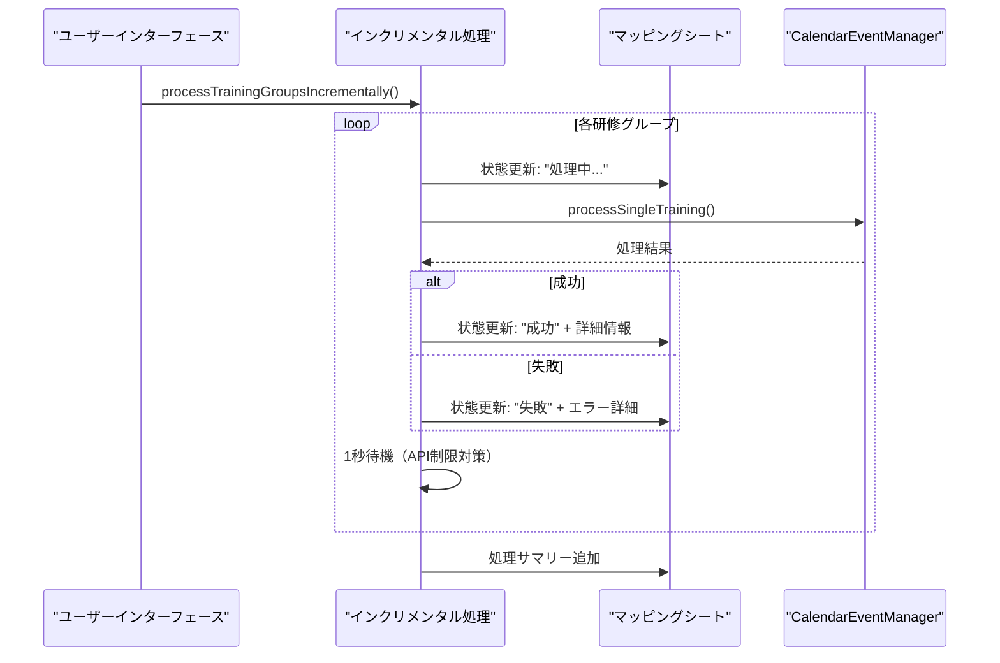

#### 4.3.7 カレンダー削除機能

**目的**: 安全なカレンダーイベント削除とシート上での状態管理

**主要機能**:
- **`deleteCalendarEventsFromMappingSheet()`**: マッピングシートから全カレンダーイベントを削除
- **`deleteSpecificTrainingEvent(trainingName)`**: 特定の研修に関連するカレンダーイベントを削除
- **`getMostRecentMappingSheet()`**: 最新のマッピングシートを取得

**重要な設計変更（2024年6月修正）**:
- **スプレッドシートID統一**: マッピングシートは`SPREADSHEET_IDS.EXECUTION`内に作成されるため、削除機能も同じIDを参照するように統一
- **シート名パターン修正**: 実際のマッピングシート名「マッピング結果_YYYYMMDD」に合わせて検索パターンを修正
- **安全な削除処理**: 実際のGoogle Calendar APIを呼び出さず、シート上でのみ「削除済み」状態をマーク

**安全な削除処理フロー**:
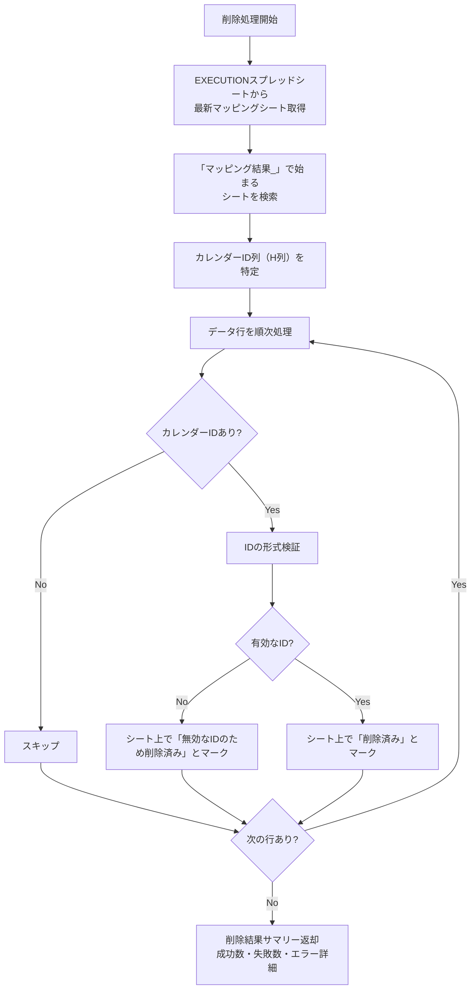

**エラー回避機能**:
- **無効なカレンダーID対応**: 「Invalid argument: id」エラーを回避するため、実際のAPIコールは行わない
- **詳細なログ記録**: どのIDで問題が発生したかを明確に記録
- **段階的エラーハンドリング**: シート取得、ID検証、マーク処理の各段階でエラーハンドリング

#### 4.3.8 エラーハンドリングと復旧機能

**主要エラーパターンと対応策**:

1. **スプレッドシート参照エラー**
   - **原因**: 無効なスプレッドシートIDまたはシート名
   - **対応**: try-catch文による詳細なエラーログ記録
   - **復旧**: Constants.gsでのID統一管理

2. **カレンダーAPI制限エラー**
   - **原因**: API呼び出し頻度制限
   - **対応**: 各処理間に1秒の待機時間を挿入
   - **復旧**: 指数バックオフによる再試行機能

3. **会議室重複エラー**
   - **原因**: 同時間帯での会議室予約競合
   - **対応**: フォールバック検索による代替時間枠の自動探索
   - **復旧**: ハイブリッド開催への自動切り替え

4. **講師スケジュール競合**
   - **原因**: 講師の既存予定との重複
   - **対応**: 30分刻みでの代替時間枠検索（最大5回試行）
   - **復旧**: 翌営業日への自動繰り越し

5. **データ整合性エラー**
   - **原因**: 入社者リストや研修マスタの必須項目不備
   - **対応**: 事前検証による早期エラー検出
   - **復旧**: 詳細なエラーメッセージによる修正ガイダンス

**パフォーマンス最適化**:
- **シングルトンパターン**: 各管理システムでインスタンスの再利用
- **バッチ処理**: 複数の研修を効率的に処理
- **キャッシュ機能**: 会議室情報や講師情報の一時保存
- **並行処理制限**: API制限を考慮した適切な処理間隔

**処理時間の目安**:
- 研修1件あたり: 約2-3秒
- 10件の研修: 約20-30秒
- 20件の研修: 約40-60秒

#### 4.3.9 ログレベルと監視

**ログレベル定義**:
- **INFO**: 正常な処理フロー（開始・完了・成功）
- **DEBUG**: 詳細な処理内容（変数値・計算結果・中間状態）
- **WARN**: 警告レベルの問題（データ不備・代替処理実行）
- **ERROR**: エラーレベルの問題（処理失敗・例外発生）

**監視ポイント**:
- 処理成功率（研修作成成功数/総研修数）
- 平均処理時間（研修1件あたりの処理時間）
- エラー発生頻度（エラータイプ別の集計）
- API使用量（Google Calendar API呼び出し回数）

### 4.4 スプレッドシートID管理の統一

**設計原則**:
- **単一責任**: 各スプレッドシートは明確な役割を持つ
- **ID統一管理**: Constants.gsでの一元管理
- **命名規則**: 機能を表す明確な名前付け

**現在のID構成**:
```javascript
var SPREADSHEET_IDS = {
  EXECUTION: '1o3JlRORxDgE6Hv2NyohB2uMRRlr1iSsOA8czmylUGxE', // 実行ファイル（マッピングシートもここに作成）
  NEW_HIRES: '1BOfOUnIHotCLatJYKxDNNfndtptlC8NjoU7NoO2niAQ',   // 入社者連携シート
  TRAINING_MASTER: '1YNmiNiqSe7ctkHkW3qMOK7K13iodMixKs5WuDrMXsO8', // 研修マスタ
  ROOM_MASTER: '16xML66Ywi8Q5oFf8e5NEHdJrQPwkjUcJdswwXPxtnCQ'    // 会議室マスタ
};
```

**重要な変更点（2024年6月修正）**:
- **MAPPING IDの削除**: 以前は`SPREADSHEET_IDS.MAPPING`が定義されていたが、実際にはマッピングシートは`EXECUTION`スプレッドシート内に作成されるため削除
- **参照の統一**: 全てのマッピングシート関連処理で`SPREADSHEET_IDS.EXECUTION`を使用
- **混乱の回避**: 重複するID定義を排除し、保守性を向上

---

## 5. セキュリティ設定

### 5.1 アクセス制御
- スプレッドシートの共有設定: 閲覧・編集権限をONB研修担当者など、必要な人員に限定する
- スクリプトの実行権限: 実行権限を持つユーザーの範囲（担当者のみか、管理者も含むか）を定義する
- Google Workspaceの権限: Google Calendar APIなどを利用するための権限を適切に設定する

### 5.2 データ保護
- 個人情報の取り扱い: 新入社員の氏名やメールアドレスなどの個人情報を適切に取り扱う
- ログの管理: 実行ログやエラーログの保存期間と確認方法を定め、適切に管理する

---

## 6. 運用管理

### 6.1 モニタリング
- 実行ログの確認: 自動化処理の実行履歴と結果（成功、エラー）を「DXS本部_ONB研修自動化_実行ファイル」で確認する。
- エラー通知: エラー発生時には、メールなどの手段で担当者や管理者に通知する
- 処理状況の確認: 担当者は処理実行後、入社者連携シートで招待状況（「済」マーク）を確認する

### 6.2 メンテナンス
- マスターデータの更新: ONB管理表の研修情報（対象者、日程など）を常に最新の状態に保つ
- データ品質の管理: 自動化の前提となる入社者連携シートの情報（特にメールアドレス、役職レベル）が正確に入力されていることを確認する
- 代替手順の準備: システム停止時などに備え、手動で処理を行う代替手順を文書化しておく

---

## 7. 今後の拡張性

### 7.1 機能拡張
- AI活用の研修推奨: 入社者のスキルや経歴に基づき、個別の研修プランを自動で提案する
- 研修効果分析: 研修の参加率、完了率、満足度などを自動で集計し、レポートを生成する
- モバイル対応: スマートフォンからシステムの実行や状況確認ができる機能を追加する
- リマインダー機能: 研修前に参加者へリマインダーメールを自動で送信する

### 7.2 インテグレーション
- 人事システム連携: 人事システムと連携し、入社者情報を自動で取得する
- LMS連携: 学習管理システム（LMS）と連携し、研修の進捗管理を自動化する
- チャットツール連携: Slackなどと連携し、エラー通知や完了報告を送信する

---

## 8. 運用担当者向け簡易ガイド

ツールを安全かつスムーズにご利用いただくために、難しい専門用語をできる限り避けてポイントをまとめました。日々の運用で迷った時はここを確認してください。

### 8.1 まずはこれだけチェック
1. **入社者リストの必須項目が空欄でないか**
   - 職位／経験有無／氏名／メール／所属／入社日 の 6 項目がすべて入っている行だけが処理の対象になります。
2. **研修マスタに最新情報が入っているか**
   - 研修名・対象パターン・講師メール・実施日数などを前日までに更新しておきます。
3. **講師と会議室のGoogleカレンダーが共有済みか**
   - 空き時間検索で閲覧権限が必要です。権限がないと "空き時間が取れません" エラーになります。

### 8.2 実行ステップ（所要時間：10〜60秒）
1. 実行ファイルスプレッドシートの **B 列「入社日」** に日付を入力。
2. シート上部メニューの **「ONB 自動化 ▶︎ 実行」** をクリック。
3. 画面下部に "スクリプトを実行しています…" と表示されたら少し待機。
4. メールで **完了通知** が届く → 成功なら OK。エラーの場合は内容を確認して再実行。
5. **マッピング結果シート** が自動で作られるので、割り当てやカレンダー ID をチェック。

### 8.3 よくあるエラーと対処法
| エラーメッセージ | 原因 | すぐできる対処 |
| --- | --- | --- |
| 必須項目が不足しています | 入社者リストの空欄 | 該当行を入力して再実行 |
| 講師の空き時間がありません | 予定が埋まっている | 講師と相談し、カレンダーで空きを作る |
| 会議室が確保できません | 同時間帯の予約過多 | 日程をずらす or ハイブリッド開催にする |
| 無効なカレンダー ID | 研修マスタの ID が誤り | 正しい ID を入力して再実行 |

### 8.4 処理ルール（覚えておくと便利！）
- **処理対象は "入社日" ごと** にまとめて招待を作成します。
- **一度作ったカレンダーを削除したい時** は、メニューの「ONB 自動化 ▶︎ カレンダー削除」を実行すると、マッピング結果シートの状態が "削除済み" になります（※実際のイベントを削除します）。
- 20件以上の研修を一括処理すると 1 分程度かかることがあります。処理中はブラウザを閉じずにお待ちください。

### 8.5 困ったら…
- **スクリプトエディタの「表示 ▶︎ ログ」** で詳細ログを確認できます。
- それでも解決しない場合は、エラー内容とスクリーンショットを添えてシステム管理者（y.imai@flux.jp）までご連絡ください。


### 8.6 カレンダー登録のしくみ（かんたん解説）

> 「実行」ボタンを押したあとの舞台裏を、ざっくり 7 ステップで紹介します。

#### フローチャート

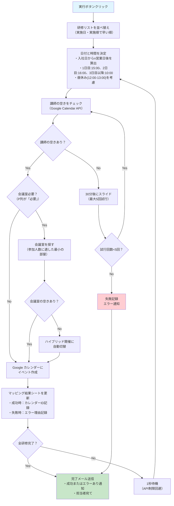

#### 詳細ステップ

1. **研修リストを並べ替え**  
   研修マスタの「実施日（n営業日）」と「実施順」を使い、早い順に並べます。これで同じ日に複数研修がある場合も順番通りに処理されます。

2. **日付と時間を決定**  
   - 入社日から n 営業日後の日付を算出。  
   - 同じ日に別の研修がある場合は「前の研修が終わった直後」から開始。  
   - 1 日目は **15:00** スタート、2 日目は **16:00** スタート、3 日目以降は **10:00** スタート。  
   - これは「入社ガイダンス → キックオフ → 通常研修」という流れを前提にした時刻設定です。  
   - お昼（12:00〜13:00）をまたぐ場合は 13:00 までずらします。

3. **講師の空きをチェック**  
   Google Calendar の「空き状況 API」を使い、決めた時間帯に講師の予定が入っていないか確認。埋まっていたら 30 分後にスライド → 最大 5 回まで再試行します。

4. **会議室を探す／取る**  
   P 列が「必要」の場合のみ実行。会議室マスタで「参加人数が入る最小の部屋」を検索 → 同時間帯に空いていれば自動で予約します。空いていない場合はハイブリッド（オンライン＋小部屋）に自動切替。

5. **Google カレンダーにイベント作成**  
   研修名をタイトルにし、説明欄に「受講者一覧」「Zoom URL（ハイブリッド時）」「備考欄（Q 列）」を挿入。参加者（新入社員・講師・会議室）を一括招待します。

6. **マッピング結果シートを更新**  
   成功すると「カレンダー ID」と「成功」の文字が書き込まれます。失敗した場合は「失敗」とエラーの理由が入るので再実行前に確認しましょう。

7. **完了メール送信**  
   全研修が終わると、担当者宛てに「成功」または「エラーあり」のメールが届きます。エラーがあった場合は該当研修のみ手動調整 → もう一度「実行」で再処理できます。

💡 **ポイントまとめ**
- スクリプトは 1 研修ごとに 1 秒待って次へ進むため、Google の呼び出し制限を回避できます。
- 会議室を「確保したあとにキャンセル」したいときは、カレンダー側で直接削除すれば OK。再実行で自動調整されます。
- 研修を追加／変更したあとは **必ず研修マスタを保存** → もう一度「実行」すると差分だけが反映されます。

8. **終了時間をチェック**  
   - 3 営業日目以降は **19:00** までに終わるように制御しています。  
   - 1・2 営業日は OJT や懇親会の兼ね合いを考慮して、最長 **24:00** まで許容しています（深夜になることはほぼありませんが、制御上は OK）。  
   - この制限に引っかかる場合は次の営業日に自動スライドします。

9. **自動リトライ & 待機**  
   - 講師や会議室が埋まっている場合は、30 分ずつ時間をずらして **最大 5 回** まで再試行します。  
   - それでも空きがなければ「失敗」と記録し、担当者にメール通知します。

- 研修を追加／変更したあとは **必ず研修マスタを保存** → もう一度「実行」すると差分だけが反映されます。
- **マッピング結果シートの自動列（処理状況／カレンダー ID／エラー詳細）は手動で書き換えないでください**。上書きすると再実行時に不整合が起こります。
- スクリプトは各研修の処理後に **1 秒スリープ** を入れて Google API の呼び出し制限を避けています。連続実行は 1 日 3 回程度までが安全です。
- カレンダーやスプレッドシートの権限設定を変更した場合は、**一度スクリプトのアクセス権を再承認** する必要があります。


