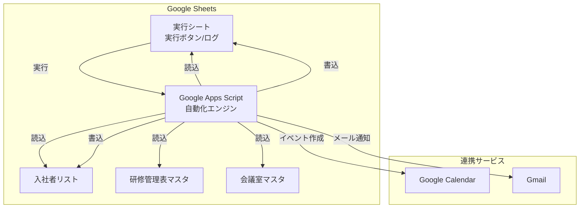
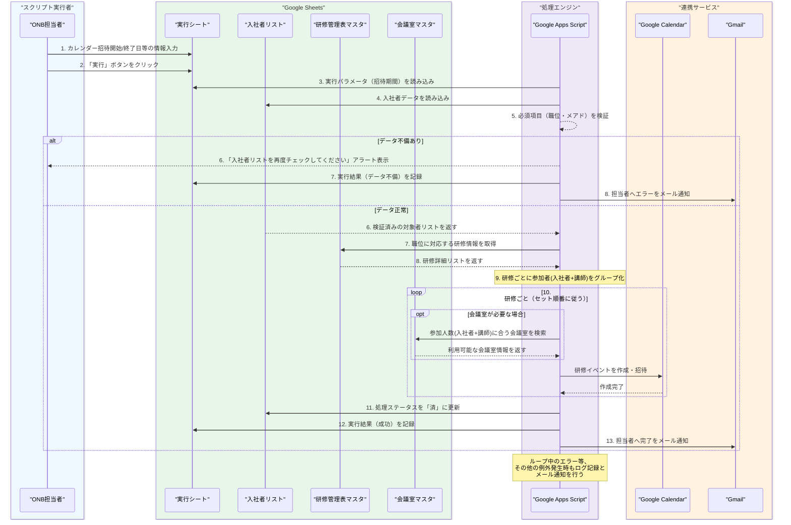
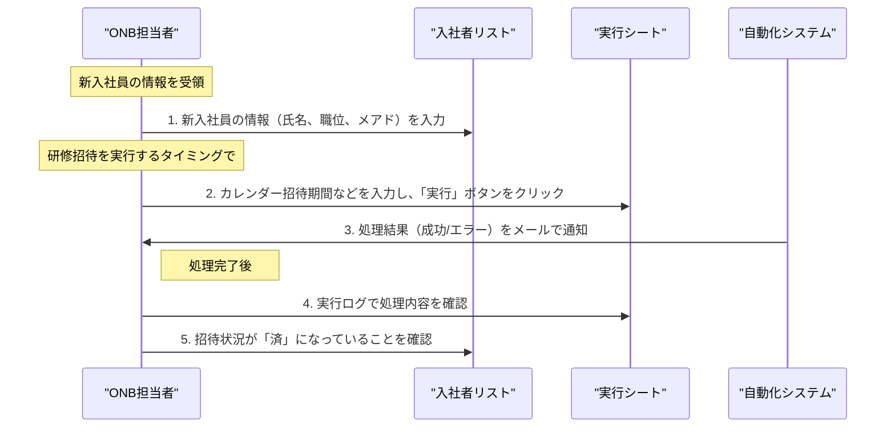
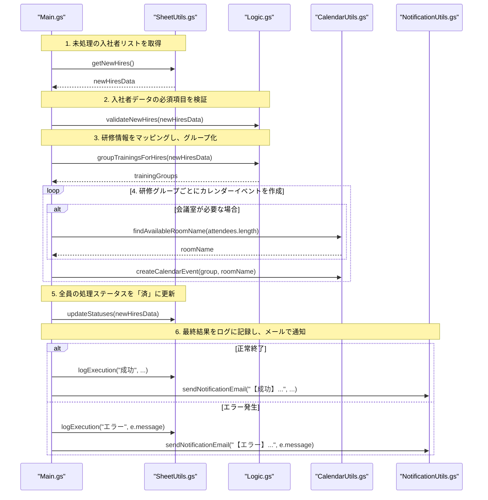

# GASを利用した研修カレンダー自動化システム

## 1. システム概要

### 1.1 目的
- Google Apps Script (GAS)を活用し、新入社員向け研修のGoogleカレンダー招待送付を自動化する
- ONB研修担当者の手動作業を削減し、業務プロセスを最適化することで作業効率を向上させる
- 送付漏れや誤った研修への招待といったヒューマンエラーを防ぎ、新入社員へ確実な研修案内を配信する

### 1.2 基本機能
- **役職別研修マッピング**: 「ONB管理表」を参照し、入社者の役職レベルに対応する研修を自動で特定する
- **自動カレンダー招待送付**: 入社者の役職に応じた研修カレンダーの招待を自動で生成し、送付する
- **送付状況の自動更新**: 招待送付が完了した対象者について、ステータスを自動で「済」マークに更新する
- **実行ログ記録**: 自動化処理の実行履歴と結果（成功・失敗）のログを保存する

## 2. 前提条件と環境設定

### 2.1 Google Workspace設定
Google Workspaceアカウントを準備し、以下のサービスを有効化する：
- Google Calendar (API)
- Google Sheets (API)
- Google Apps Script
- Gmail (API)（通知用）

### 2.2 スプレッドシート構成
| シート名 | 使用シート | 列情報 | サンプルリンク |
|:---|:---|:---|:---|
| **DXS本部_入社者連携シート** | 入社者リスト | • **A列**: 職位 (必須) • **B列**: 氏名 • **D列**: メールアドレス (必須) • **E列**: 処理状況 | [DXS本部_入社者連携シート](https://docs.google.com/spreadsheets/d/1BOfOUnIHotCLatJYKxDNNfndtptlC8NjoU7NoO2niAQ/edit?gid=332221570#gid=332221570) |
| **DXS本部_ONB研修マスタ** | 研修管理表マスタ | • **B列**: 研修種別 (「DX ONB/ビジネススキル研修」を対象) • **D列**: 研修名称 • **E-H列**: 対象職位 • **K列**: セット順番 • **L列**: 時間 • **P列**: 講師メールアドレス • **Q列**: 会議室要否 • **R列**: カレンダーメモ | [DXS本部_ONB研修マスタ](https://docs.google.com/spreadsheets/d/1YNmiNiqSe7ctkHkW3qMOK7K13iodMixKs5WuDrMXsO8/edit?gid=696885769#gid=696885769) |
| **FLUX_六本木オフィス会議室マスタ** | 会議室マスタ | • **A列**: 会議室名 • **B列**: 定員 | [FLUX_六本木オフィス会議室リスト](https://docs.google.com/spreadsheets/d/16xML66Ywi8Q5oFf8e5NEHdJrQPwkjUcJdswwXPxtnCQ/edit?gid=0#gid=0) |
| **DXS本部_ONB研修自動化_実行ファイル** | 実行シート | • **A列**: 実行日時 • **B列**: 実行者 • **C列**: カレンダー招待開始日 • **D列**: カレンダー招待終了日 • **E列**: 処理結果 • **F列**: 詳細メッセージ | [DXS本部_ONB研修自動化_実行ファイル](https://docs.google.com/spreadsheets/d/1o3JlRORxDgE6Hv2NyohB2uMRRlr1iSsOA8czmylUGxE/edit?gid=0#gid=0) |

## 3. システム構成

### 3.1 アーキテクチャ構成

### 3.2 データフロー

#### 3.2.1 システム処理フロー

#### 3.2.2 テキストベースの処理フロー
1.  **実行トリガー**
    -   ONB担当者が`実行シート`を開き、`C列: カレンダー招待開始日`と`D列: カレンダー招待終了日`を入力後、「実行」ボタンをクリックする。

2.  **データ読み込みと検証**
    -   GASは`入社者リスト`を参照し、`E列: 処理状況`が「未処理」の行を取得する。
    -   対象行ごとに、`A列: 職位`と`D列: メールアドレス`に値が入っているか検証する。
    -   一つでも不備があれば、担当者にアラートを表示し、`実行シート`の`E列: 処理結果`に「データ不備エラー」と記録して処理を中断する。

3.  **研修情報のマッピング**
    -   GASは`研修管理表マスタ`を読み込み、`B列: 研修種別`が「DX ONB/ビジネススキル研修」の研修を抽出する。
    -   検証済みの入社者ごとに、`入社者リスト`の`A列: 職位`と`研修管理表マスタ`の`E-H列: 対象職位`を照合し、参加すべき研修を特定する。

4.  **研修グループの作成**
    -   研修ごとに、参加者（入社者リスト）と、`研修管理表マスタ`の`P列: 講師メールアドレス`を参加者としてグループ化する。
    -   各研修グループに、`D列: 研修名称`、`K列: セット順番`、`L列: 時間`、`Q列: 会議室要否`、`R列: カレンダーメモ`の情報を紐付ける。

5.  **カレンダーイベント作成と招待**
    -   研修グループを`K列: セット順番`の昇順にソートして、一つずつ処理する。
    -   **会議室検索**: `Q列`が「必要」の場合、参加者（入社者＋講師）の合計人数を計算し、その人数を収容できる会議室を`会議室マスタ`の`B列: 定員`を基に検索する。該当する会議室の`A列: 会議室名`を取得する。
    -   **イベント作成**: Google Calendar APIを介し、`L列: 時間`、確保した会議室名（場所として設定）、参加者（入社者＋講師）、`R列: カレンダーメモ`を内容としてイベントを作成し、招待を送付する。

6.  **ステータス更新とログ記録**
    -   招待が完了した入社者について、`入社者リスト`の`E列: 処理状況`を「済」に更新する。
    -   全処理が正常に完了したら、`実行シート`に「成功」と記録し、担当者に完了通知メールを送信する。
    -   処理中にエラーが発生した場合は、その内容を`実行シート`に記録し、エラー通知メールを送信する。

#### 3.2.3 人事担当者の運用フロー

## 4. 実装仕様

### 4.1 GASスクリプト構成
今回の実装では、メンテナンス性と可読性を向上させるため、機能ごとにファイルを分割しています。

#### `Main.gs` - メイン処理
スクリプト全体の起点となるファイルです。UI（メニュー）の作成や、各モジュールを呼び出して処理全体を制御するメイン関数が含まれます。
- **`onOpen()`**: スプレッドシートを開いた時にカスタムメニューをUIに追加します。
- **`executeONBAutomation()`**: 実行ボタンから呼び出されるメイン関数。データ取得、検証、カレンダー作成、ステータス更新、通知までの一連の処理フローを管理し、エラーハンドリングを行います。

#### `Constants.gs` - 定数管理
スプレッドシートのIDやシート名、通知先のメールアドレスなど、プロジェクト全体で共有される設定値を定数として管理します。
- `SPREADSHEET_IDS`
- `SHEET_NAMES`
- `NOTIFICATION_EMAIL`

#### `SheetUtils.gs` - スプレッドシート操作
Google Sheetsに対するデータの読み書きに特化したユーティリティ関数を管理します。
- **`getNewHires() : Array<Object>`**: `入社者リスト`から未処理のデータを取得します。
- **`updateStatuses(processedHires: Array<Object>)`**: 処理が完了した入社者のステータスを`入社者リスト`上で「済」に更新します。
- **`logExecution(params: Object, status: string, message: string)`**: `実行シート`に処理結果のログを記録します。

#### `Logic.gs` - ビジネスロジック
アプリケーションの中核となるロジック（データ検証、研修のマッピングなど）を担当します。
- **`validateNewHires(newHires: Array<Object>)`**: `入社者リスト`の必須項目が入力されているか検証します。
- **`groupTrainingsForHires(newHires: Array<Object>) : Array<Object>`**: 入社者と`研修管理表マスタ`を基に、研修ごとの参加者や詳細情報をグループ化します。

#### `CalendarUtils.gs` - カレンダー連携
Google Calendarとの連携に特化したユーティリティ関数を管理します。
- **`findAvailableRoomName(numberOfAttendees: number) : string`**: `会議室マスタ`から参加人数に合う会議室を検索します。
- **`createCalendarEvent(trainingDetails: Object, roomName: string)`**: 研修情報と会議室名を基に、カレンダーイベントを作成し招待を送付します。

#### `NotificationUtils.gs` - 通知処理
メール通知に関する処理を専門に担当します。
- **`sendNotificationEmail(subject: string, body: string)`**: 担当者へ処理結果（成功・エラー）の通知メールを送信します。

#### 4.1.1 関数呼び出しフロー
`executeONBAutomation`関数が各モジュールの関数を呼び出す流れを以下に示します。

### 4.2 エラーハンドリング
- try-catch文による例外処理を`Main.gs`の`executeONBAutomation`に実装する。
- データ不備、会議室の空き無し、APIエラーなど、予期されるエラーは個別のメッセージでハンドリングし、ログとメールで担当者に通知する。
- 処理の実行履歴とエラー内容を「DXS本部_ONB研修自動化_実行ファイル」にログとして保存する。
- 部分的な失敗が発生した場合、手動で補完できる運用を想定する。

## 5. セキュリティ設定

### 5.1 アクセス制御
- スプレッドシートの共有設定: 閲覧・編集権限をONB研修担当者など、必要な人員に限定する
- スクリプトの実行権限: 実行権限を持つユーザーの範囲（担当者のみか、管理者も含むか）を定義する
- Google Workspaceの権限: Google Calendar APIなどを利用するための権限を適切に設定する

### 5.2 データ保護
- 個人情報の取り扱い: 新入社員の氏名やメールアドレスなどの個人情報を適切に取り扱う
- ログの管理: 実行ログやエラーログの保存期間と確認方法を定め、適切に管理する

## 6. 運用管理

### 6.1 モニタリング
- 実行ログの確認: 自動化処理の実行履歴と結果（成功、エラー）を「DXS本部_ONB研修自動化_実行ファイル」で確認する。
- エラー通知: エラー発生時には、メールなどの手段で担当者や管理者に通知する
- 処理状況の確認: 担当者は処理実行後、入社者連携シートで招待状況（「済」マーク）を確認する

### 6.2 メンテナンス
- マスターデータの更新: ONB管理表の研修情報（対象者、日程など）を常に最新の状態に保つ
- データ品質の管理: 自動化の前提となる入社者連携シートの情報（特にメールアドレス、役職レベル）が正確に入力されていることを確認する
- 代替手順の準備: システム停止時などに備え、手動で処理を行う代替手順を文書化しておく

## 7. 今後の拡張性

### 7.1 機能拡張
- AI活用の研修推奨: 入社者のスキルや経歴に基づき、個別の研修プランを自動で提案する
- 研修効果分析: 研修の参加率、完了率、満足度などを自動で集計し、レポートを生成する
- モバイル対応: スマートフォンからシステムの実行や状況確認ができる機能を追加する
- リマインダー機能: 研修前に参加者へリマインダーメールを自動で送信する

### 7.2 インテグレーション
- 人事システム連携: 人事システムと連携し、入社者情報を自動で取得する
- LMS連携: 学習管理システム（LMS）と連携し、研修の進捗管理を自動化する
- チャットツール連携: Slackなどと連携し、エラー通知や完了報告を送信する

