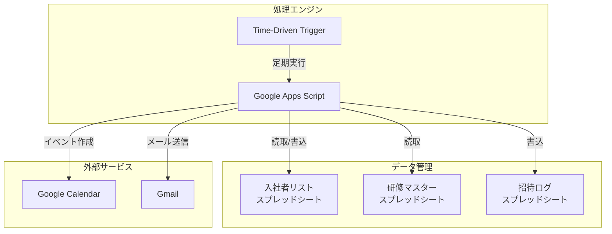
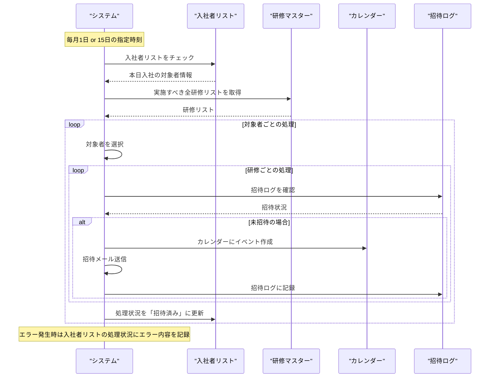
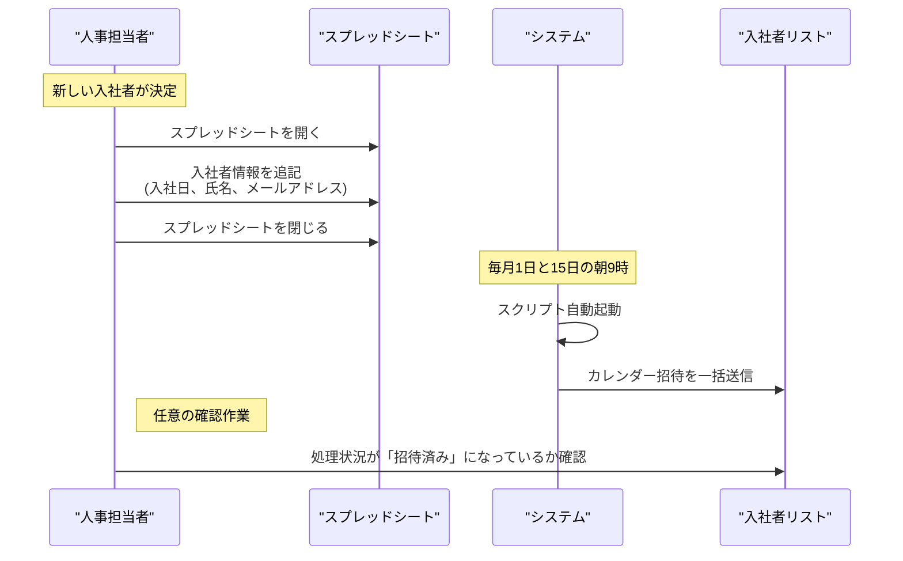

# GASを利用した研修カレンダー自動化システム

## 1. システム概要

### 1.1 目的
- Google Apps Script (GAS)を活用した研修カレンダー招待の自動化
- 人事担当者の作業負荷軽減
- 処理状況の可視化と管理効率の向上

### 1.2 基本機能
1. スプレッドシートでの入社者情報管理
2. 定期的な研修カレンダー招待の自動送信
3. 処理状況の自動更新と管理
4. エラー発生時の通知と記録

## 2. 前提条件と環境設定

### 2.1 Google Workspace設定
1. Google Workspaceアカウントの準備
2. 必要なサービスの有効化
   - Google Calendar
   - Google Spreadsheet
   - Google Apps Script

### 2.2 スプレッドシート構成
1. 入社者リストシート
   - 入社日
   - 氏名
   - メールアドレス
   - 処理状況（未処理/招待済み/エラー）

2. 研修マスターシート
   - 研修名
   - 所要時間
   - 実施タイミング（入社日からの日数）
   - 必須/任意区分

## 3. システム構成

### 3.1 アーキテクチャ構成


### 3.2 データフロー

#### 3.2.1 システム処理フロー


#### 3.2.2 人事担当者の運用フロー


## 4. 実装仕様

### 4.1 GASスクリプト構成
1. メイン処理
   ```javascript
   function processNewEmployees() {
     // 新入社員の研修カレンダー招待処理
   }
   ```

2. トリガー設定
   ```javascript
   function setTrigger() {
     // 毎月1日と15日の朝9時に実行
   }
   ```

3. ユーティリティ関数
   ```javascript
   function createCalendarEvent() {
     // カレンダーイベント作成
   }
   
   function updateStatus() {
     // 処理状況の更新
   }
   
   function sendErrorNotification() {
     // エラー通知の送信
   }
   ```

### 4.2 エラーハンドリング
- スプレッドシートアクセスエラー
- カレンダーAPI制限エラー
- メール送信エラー
- データ不整合エラー

## 5. セキュリティ設定

### 5.1 アクセス制御
1. スプレッドシートの共有設定
2. スクリプトの実行権限
3. カレンダーのアクセス権限

### 5.2 データ保護
1. 個人情報の取り扱い
2. エラーログの管理
3. 実行ログの保管

## 6. 運用管理

### 6.1 モニタリング
1. 実行ログの確認方法
2. エラー通知の設定
3. 処理状況の確認手順

### 6.2 メンテナンス
1. スクリプトの定期的な見直し
2. マスターデータの更新手順
3. バックアップ方法

## 7. 今後の拡張性
1. 機能拡張
   - 研修の出欠管理機能
   - リマインダー機能
   - 研修資料の自動配布

2. インテグレーション
   - Slack連携
   - 社内システムとの連携
   - レポート機能の強化 