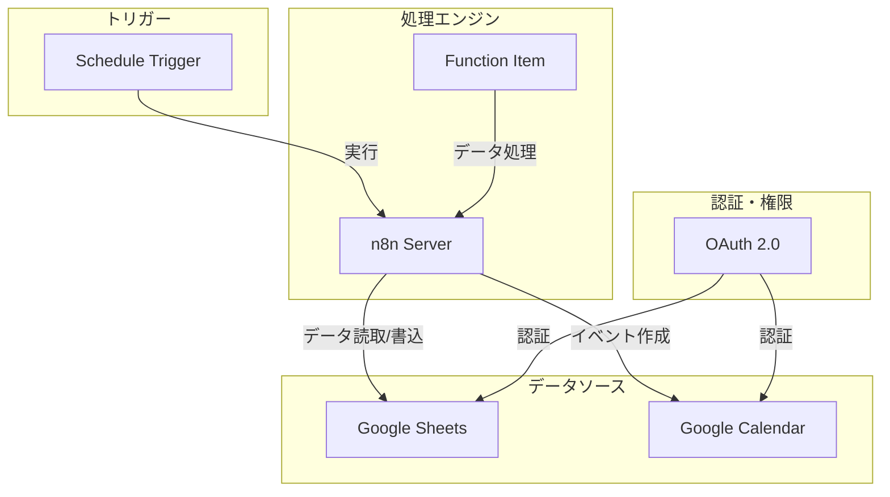
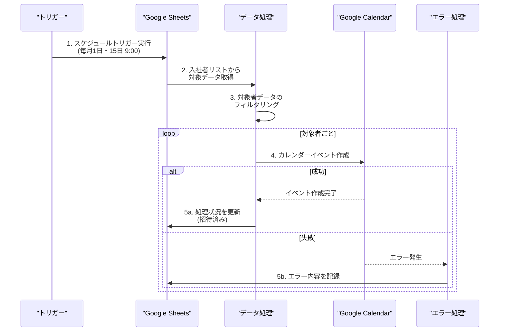

# n8nとGoogleカレンダーの連携システム

## 1. システム概要

### 1.1 目的
- 新入社員の研修カレンダー招待の自動化
- 人事業務の効率化
- 処理状況の可視化

### 1.2 基本機能
1. 定期的な新入社員データの取得
2. 研修カレンダーへの自動招待
3. 処理状況の管理
4. エラー通知と記録

## 2. 前提条件と環境設定

### 2.1 Google側の準備
1. Google Cloud Projectの作成
2. OAuth 2.0認証情報の設定
   - 認証情報の種類: OAuthクライアントID
   - アプリケーションの種類: ウェブアプリケーション
   - 承認済みのリダイレクトURI: n8nのCallback URL
3. 必要なAPIの有効化
   - Google Calendar API
   - Google Sheets API（入社者リスト用）

### 2.2 n8n側の準備
1. n8nのインストールと起動
2. Google認証情報の設定
   - クライアントID
   - クライアントシークレット
   - スコープ設定（calendar.eventsなど）

## 3. システム構成

### 3.1 アーキテクチャ構成

### 3.2 データフロー

## 4. 実装仕様

### 4.1 n8nワークフローの基本設定
1. Schedule Triggerノード
   - 実行時刻: 毎月1日・15日の9:00
   - タイムゾーン: Asia/Tokyo

2. Google Sheetsノード
   - 操作: スプレッドシートから読み取り
   - 対象シート: 入社者リスト
   - 取得項目: 入社日、氏名、メールアドレス、処理状況

3. Function Item
   - 本日の日付と入社日の一致確認
   - 未処理データのフィルタリング

4. Google Calendarノード
   - 操作: イベント作成
   - カレンダーID: 研修用カレンダー
   - イベント詳細設定
     - タイトル: "${研修名}"
     - 説明: 研修の詳細情報
     - 参加者: 対象者のメールアドレス
     - 日時: 研修スケジュールに基づく

### 4.2 エラーハンドリング
- タイムアウト対策
- API制限への対応
- 重複チェック
- エラーログの保存
- 管理者への通知設定

## 5. セキュリティ設定

### 5.1 アクセス制御
1. アクセス権限の最小化
2. APIキーの安全な管理

### 5.2 データ保護
1. データの暗号化
2. アクセスログの保管
3. 定期的な監査

## 6. 運用管理

### 6.1 モニタリング
1. ワークフロー実行ログの確認方法
2. エラー発生時の対応フロー

### 6.2 メンテナンス
1. バックアップと復旧手順
2. 定期的なメンテナンス項目
3. 監視項目と閾値

## 7. 今後の拡張性
1. 他のGoogleサービスとの連携
2. 研修スケジュールの自動調整
3. 参加者の出欠管理
4. レポート機能の追加
5. 他のカレンダーシステムとの連携 